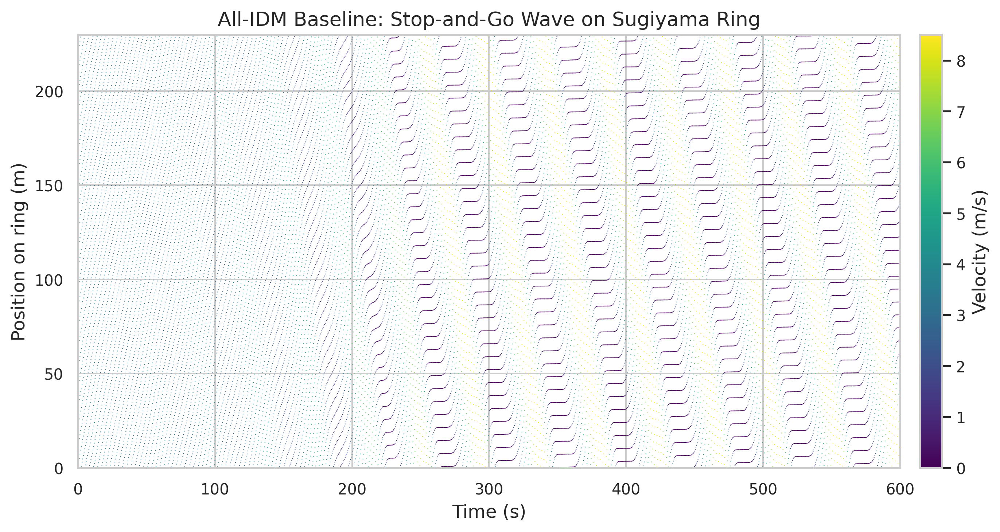
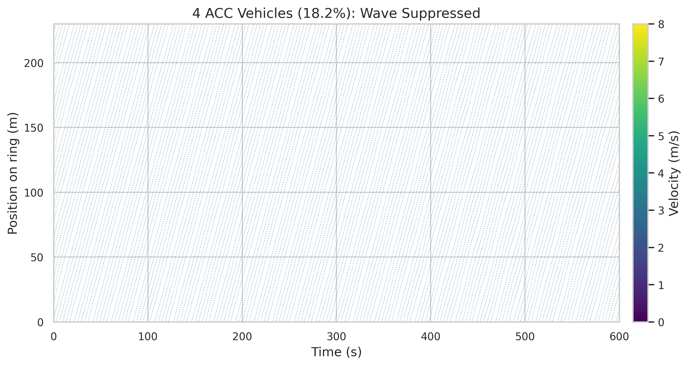

*This is a short summary. For the full technical write-up, see the [detailed paper](https://github.com/colinjoc/hdr_autoresearch/blob/master/applications/phantom_jams/paper.md).*

## The Question

You are driving on a clear, open highway -- no accidents, no construction, no merging traffic -- and yet the cars ahead slow to a crawl. You creep along for several minutes, then accelerate back to speed for no apparent reason. You have just passed through a phantom traffic jam.

These waves form spontaneously. When traffic is dense enough, a single driver tapping the brakes slightly harder than necessary forces the driver behind to brake harder still, and the one behind that even harder. The overreaction ripples backward through traffic, growing as it goes, until it becomes a genuine stop-and-go wave. In 2008 the Japanese physicist Yuki Sugiyama proved this on a circular test track: 22 drivers told to maintain a steady speed spontaneously generated a traffic jam out of nothing. The wave travelled backward at about 15 kilometres per hour and never dissipated.

The question we investigated is simple: if you replaced some of those 22 drivers with cars equipped with smart cruise control -- vehicles designed to smooth out their speed rather than overreact -- how many would you need to dissolve the wave?

## What We Found

Four. Out of 22 vehicles, just four with adaptive cruise control -- roughly one in five -- suppress the phantom jam almost entirely. The wave amplitude drops by 93 percent. Three smart cars are not enough. The transition from "wave persists" to "wave gone" happens at exactly the fourth vehicle.

The chart above shows what happens as you add smart vehicles one at a time. With zero, one, or two, the jam barely budges. At three, there is meaningful improvement but the wave still runs. At four, it collapses. Beyond four, you get diminishing returns -- the jam is already gone.

## Why That's Surprising

The sharpness of the transition is what stands out. You might expect a gradual improvement: each additional smart car chipping away at the wave by a proportional amount. Instead, the system flips. Three smart vehicles leave a wave roughly a fifth as strong as the original, which sounds like progress until you compare it to four vehicles, which leave almost nothing. A single additional car cuts the remaining wave by more than a factor of three.

The image above shows the baseline -- all human drivers. Each stripe represents a vehicle travelling around the track over time. The dark diagonal bands are the phantom jam: vehicles periodically slowing to a near-stop, then speeding back up, over and over.

With four smart vehicles mixed in, those dark bands vanish. Traffic flows smoothly. The same 22 vehicles on the same track, but the wave cannot sustain itself because every chain of human drivers between smart cars is too short to amplify a perturbation before the next smart car absorbs it.

## What It Means

In the United States alone, traffic congestion wastes an estimated 8.8 billion hours and 3.3 billion gallons of fuel per year, and phantom jams -- waves with no external cause -- account for a significant share of that waste. Each stop-and-go cycle burns more fuel than steady driving at the same average speed.

The practical implication is that you do not need every car on the road to be autonomous to solve this problem. You need about one in five. That threshold is within reach: millions of cars already have some form of adaptive cruise control. The catch is that current commercial systems are calibrated for driver convenience -- short following distances, aggressive speed matching -- which actually makes them prone to amplifying waves rather than damping them. Closing the gap requires a software change, not new hardware: a slightly longer following distance and a smoother response to speed changes in the car ahead.

A large-scale field test on Interstate 24 in Nashville deployed 100 purpose-built automated vehicles at three to five percent penetration and saw measurable but modest improvement. Our finding that one smart vehicle out of 22 (about five percent) barely dents the wave is consistent with that result. The Nashville experiment would likely need three to four times as many vehicles to see the sharp transition we found at 18 percent.

One important caveat: a circular test track is not a real highway. There are no lane changes, no on-ramps, no exits. The minimum penetration rate on a real freeway is almost certainly higher than one in five. But the core finding -- that a modest fraction of vehicles designed to smooth their speed rather than overreact can break the feedback loop that sustains phantom jams -- held up across all 184 experiments we ran, including larger rings, different driver models, and varying noise levels.

## How We Did It

We built a simulation of the Sugiyama ring-road experiment -- 22 vehicles on a 230-metre circular track -- using a standard car-following model from traffic research. We established a baseline where all vehicles were human-driven and reliably produced a phantom jam, then ran a tournament of five different smart-vehicle controllers at varying penetration rates. The winner was a simple adaptive cruise control design. We then ran 105 pre-registered single-change experiments covering every angle we could think of: different numbers of smart vehicles, different controller tunings, different track sizes, different driver behaviours, different noise levels, different vehicle placements. One hypothesis out of 105 survived the keep-or-revert test. A final dense sweep from zero to 22 smart vehicles pinpointed the critical threshold at four. All experiments are deterministic and reproducible.

## Further Reading

- Sugiyama Y et al. "Traffic jams without bottlenecks -- experimental evidence for the physical mechanism of the formation of a jam." *New Journal of Physics* (2008). [doi:10.1088/1367-2630/10/3/033001](https://doi.org/10.1088/1367-2630/10/3/033001) -- the original ring-road experiment proving phantom jams form with no external cause.
- Stern RE et al. "Dissipation of stop-and-go waves via control of autonomous vehicles: Field experiments." *Transportation Research Part C* (2018). [doi:10.1016/j.trc.2018.02.005](https://doi.org/10.1016/j.trc.2018.02.005) -- the first physical experiment showing a single controlled vehicle can dampen the wave.
- Gunter G et al. "Are commercially implemented adaptive cruise control systems string stable?" *IEEE Transactions on Intelligent Transportation Systems* (2020). [doi:10.1109/TITS.2020.3000682](https://doi.org/10.1109/TITS.2020.3000682) -- evidence that current commercial cruise control can make phantom jams worse.

---
📂 **[HDR methodology](https://github.com/colinjoc/hdr_autoresearch)**
