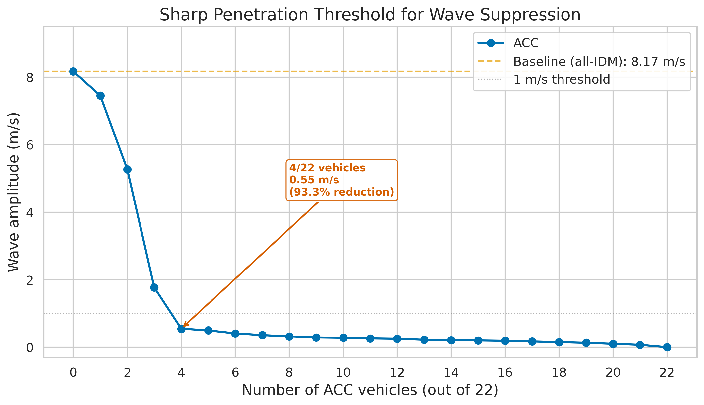

*This is a short summary. For the full technical write-up, see the [detailed paper](https://github.com/colinjoc/hdr_autoresearch/blob/main/applications/phantom_jams/paper.md).*

## The Question

You are driving on a clear, open highway -- no accidents, no construction, no merging traffic -- and yet the cars ahead slow to a crawl. You creep along for several minutes, then accelerate back to speed for no apparent reason. You have just passed through a phantom traffic jam.

These waves form spontaneously. When traffic is dense enough, a single driver tapping the brakes slightly harder than necessary forces the driver behind to brake harder still, and the one behind that even harder. The overreaction ripples backward through traffic, growing as it goes, until it becomes a genuine stop-and-go wave. In 2008 the Japanese physicist Yuki Sugiyama [proved this on a circular test track](https://doi.org/10.1088/1367-2630/10/3/033001): 22 drivers told to maintain a steady speed spontaneously generated a traffic jam out of nothing. The wave travelled backward at about 20 kilometres per hour and never dissipated. If you replaced some of those 22 drivers with cars equipped with smart cruise control -- vehicles designed to smooth out their speed rather than overreact -- how many would you need to dissolve the wave?

## What We Found

Four. Out of 22 vehicles, just four with adaptive cruise control -- roughly one in five -- suppress the phantom jam almost entirely. Across five independent simulation runs with different random seeds, wave amplitude drops by 88 percent. Three smart cars leave a wave more than twice as strong. The difference between three and four is statistically significant.

- **Sharp threshold**: with zero, one, or two smart vehicles the jam barely budges. At three there is meaningful improvement but the wave still runs. At four it collapses. Beyond four, diminishing returns -- the jam is already nearly gone.
- **Fuel savings come free**: eliminating the stop-and-go cycle cuts the fuel proxy by about 18 percent, with no additional effort beyond wave suppression.
- **Spacing matters more than numbers**: four smart vehicles clustered together perform nearly five times worse than four spread evenly around the track, because clustering leaves one long chain of human drivers that can still sustain the wave.
- **An alternative controller designed specifically for wave suppression** matches the adaptive cruise control's performance when its parameters are tuned to the track's conditions, but imposes a 61 percent throughput penalty. A third controller using integral feedback is catastrophically unstable, making the jam worse than if no smart vehicles were present.
- **Sensor delay kills the effect**: half a second of lag in the control loop erases most of the benefit. The smart vehicles need fast feedback to work.

## Why That's Surprising

The prior literature -- particularly the [2018 field experiment by Stern and colleagues](https://doi.org/10.1016/j.trc.2018.02.005) -- demonstrated that a single controlled vehicle among 21 humans could dissipate the wave on a physical test track. Reinforcement learning researchers using the [Flow framework](https://github.com/flow-project/flow) reported wave suppression at about five percent penetration (one vehicle out of 22). Our finding that a hand-designed adaptive cruise control needs four vehicles (18 percent) to achieve the same outcome is a much higher bar.

The surprise cuts in two directions. First, the transition is remarkably sharp: adding a single vehicle (from three to four) cuts the residual wave by more than half. This happens because four evenly-spaced smart vehicles break every chain of human drivers to at most four or five vehicles, which we measured to be safely below the critical chain length of eight to nine vehicles needed to sustain a wave. Second, the fact that commercially available cruise control technology -- not purpose-built wave-suppression hardware -- can achieve near-complete suppression at under 20 percent penetration is encouraging for near-term deployment, even if learning-based controllers can do it with fewer vehicles.

## What It Means

For traffic engineers and policymakers, the key takeaway is that the problem is solvable with existing technology, but the numbers matter. A handful of vehicles with smooth, gap-aware cruise control can eliminate phantom jams on a simple track. Real highways -- with lane changes, on-ramps, heterogeneous drivers, and sensor delays -- will require higher penetration rates. The 2022 [MegaVanderTest on Interstate 24](https://arxiv.org/abs/2404.15533) deployed 100 automated vehicles at three to five percent and saw measurable but modest improvement, consistent with our finding that five percent barely dents the wave even on a simpler track.

The practical path forward likely involves two threads: improving controller design (learning-based approaches have already shown a four-fold reduction in the required penetration rate) and pushing sensor-to-actuator latency below a third of a second. Vehicles that react too slowly simply cannot absorb the perturbations fast enough. The finding that vehicle placement matters as much as vehicle count also has implications for deployment strategy -- even a small fleet of smart vehicles should be distributed across the traffic stream, not clustered in a single platoon.

## How We Did It

We built a pure-Python simulation of the Sugiyama ring-road experiment -- 22 vehicles on a 230-metre circular track -- using the Intelligent Driver Model, a standard car-following model from traffic research. Following the [HDR methodology](https://github.com/colinjoc/hdr_autoresearch), we ran 184 experiments total: a tournament of five controller families, 105 pre-registered single-change experiments covering controller tuning, track size, driver heterogeneity, noise levels, and vehicle placement, plus composition tests and a dense sweep from zero to 22 smart vehicles. Note: these results are based on a simulation calibrated to the published Sugiyama ring-road parameters, not measured vehicle trajectories. The simulation reproduces the canonical phantom jam but does not incorporate real-world complexities like lane changes or sensor noise (beyond targeted sensitivity tests). Critical results were replicated across five random seeds to establish statistical significance.

## Further Reading

- Sugiyama Y et al. "Traffic jams without bottlenecks -- experimental evidence for the physical mechanism of the formation of a jam." *New Journal of Physics* (2008). [doi:10.1088/1367-2630/10/3/033001](https://doi.org/10.1088/1367-2630/10/3/033001) -- the original ring-road experiment proving phantom jams form with no external cause.
- Stern RE et al. "Dissipation of stop-and-go waves via control of autonomous vehicles: Field experiments." *Transportation Research Part C* (2018). [doi:10.1016/j.trc.2018.02.005](https://doi.org/10.1016/j.trc.2018.02.005) -- the first physical experiment showing a single controlled vehicle can dampen the wave.
- Gunter G et al. "Are commercially implemented adaptive cruise control systems string stable?" *IEEE Transactions on Intelligent Transportation Systems* (2021). [doi:10.1109/TITS.2020.3000682](https://doi.org/10.1109/TITS.2020.3000682) -- evidence that current commercial cruise control systems can actually make phantom jams worse.

---

📂 **[HDR methodology](https://github.com/colinjoc/hdr_autoresearch)** — the framework and full project history
