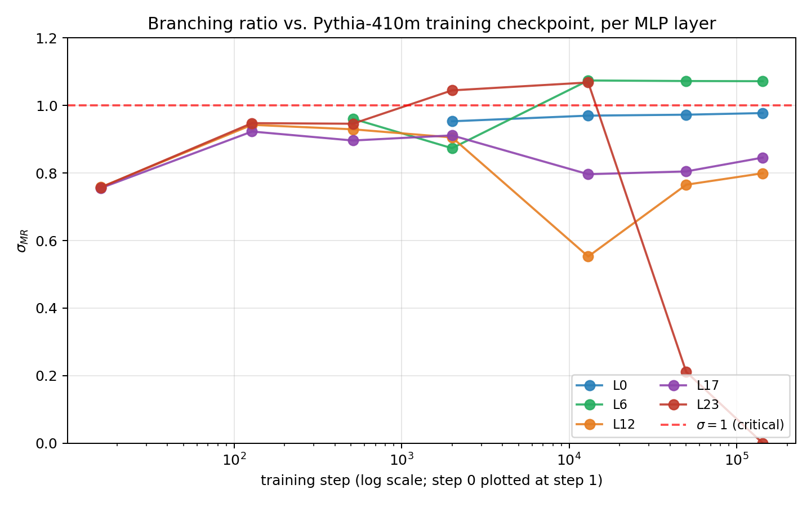
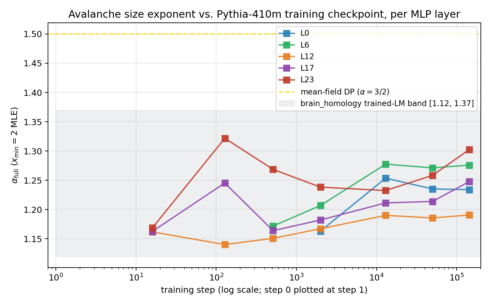

*A plain-language summary. The [full technical paper](https://github.com/colinjoc/generalized_hdr_autoresearch/blob/main/applications/criticality_llm_training/paper_submission_multiscale.md) has the full results, the limitations, and the disagreement appendix. See [About HDR](/hdr/) for how this work was produced and reviewed.*

**Bottom line.** Neuroscientists describe the cortex as sitting at a delicate balance point — what they call the "critical" regime — that emerges from years of development. We measured the same kind of balance on the activations of language models, expecting that pretraining would slowly walk a model into it. For the smallest Pythia models that turns out to be wrong: the balance is already there at random initialisation, before a single training step. The same balance is missing from every other small language model we tested. The cause appears to be a quirk of one specific recipe for initialising the weights — not a property of language models in general.

## The Question

A long line of physics-of-the-brain work (Beggs and Plenz, 2003) describes cortex as poised at a balance point — the "critical" regime — where avalanches of activity follow a near-power-law size distribution and a branching ratio (the number of follow-up spikes per spike) sits close to one. A growing number of papers report that the same kind of branching balance appears in trained neural networks. The unspoken assumption has been that this balance is something networks **acquire during training**: the model starts in some uninteresting state, and pretraining walks it into the critical regime. Earlier work of ours, on a single language-model size, seemed to support that picture — the balance appeared inside the first sixteen optimiser steps.

We wanted to know whether that "criticality emerges during pretraining" picture really holds, or whether the answer depends on the size and recipe of the model. So we measured five sizes of one model family, three sizes of two more model families, three different random starting points each, and once with the input replaced by random noise.

## What we found

The "balance appears in the first 16 training steps" picture from earlier work survives at one specific scale and not at others. At the two largest sizes we measured, every layer is far below the measurement threshold at random initialisation — there is genuinely nothing to measure until training has run for several hundred steps. At the two smallest Pythia sizes, the balance is already there at step zero. And we cannot reproduce that small-Pythia "balance at step zero" behaviour in any non-Pythia model we tried.

<figure>
  
  <figcaption><strong>Figure 1.</strong> Branching ratio against training step for the 410-million-parameter Pythia model. Each line is a different layer of the network. By step 16 most layers are already near the balance value of one. The pre-step-16 portion is missing for the larger models, where activations are too small to measure at random initialisation.</figcaption>
</figure>

The headlines:

- **Below 410 million parameters, Pythia is already "critical" at random initialisation.** At Pythia-70M and Pythia-160M, the branching ratio at step zero — with the trained weights replaced by random ones — sits around 0.83, inside the same balance band where neuroscientists place the cortex. Across three different random starting points, the cross-seed standard deviation at the 160-million-parameter mid-layers is just 0.004 to 0.008. Three independent random seeds produce three numerically nearly identical numbers.
- **Random-initialisation values barely move during 143,000 steps of training.** At 160 million parameters, mid-layer 11 measures 0.827 at random init and 0.830 after full training. The number of avalanches that cross the measurement threshold goes up by 1 to 2 orders of magnitude, but the balance value barely shifts.
- **No non-Pythia model in this study replicates that step-zero balance.** GPT-Neo-125M (an EleutherAI model with the same architectural shape as Pythia-160M but a different initialisation recipe) produces zero measurable layers across three random starting points. Two Qwen2.5 models (a Llama-style family) also produce zero measurable layers across three starting points each. The maximum number of avalanches across 45 measurements at three non-Pythia models was 47 — well below the threshold needed to fit the statistic at all.
- **Above 1 billion parameters, all of this disappears.** At Pythia-1B and Pythia-1.4B, every layer at random initialisation is far below the measurement threshold. Training genuinely has to grow the activations.
- **At those large sizes, training-time onset is not smooth — it has three phases.** Only the deepest layer of the 1.4-billion-parameter network is measurable from step 128 to step 512. Then at step around 1000 four out of five layers light up simultaneously, with their balance values clustered in a tight 0.09-wide window. Then between step 1000 and step 2000, things become turbulent: the count of measurable layers actually drops from 4 to 3 before recovering by step 13,000.

<figure>
  
  <figcaption><strong>Figure 2.</strong> A complementary statistic — the avalanche-size exponent — against training step. The shaded band is the cortex-style target (1.12 to 1.37) inherited from the earlier sibling study. At the 410-million-parameter scale, every layer's final value lands inside the band; at the smaller two sizes the values overshoot the band's upper edge.</figcaption>
</figure>

We swapped out the real text input for uniformly-random token IDs to see whether the small-Pythia balance was a property of the architecture alone or whether it relied on the structure of natural-language input. The 70-million-parameter signature survives the swap (4 of 5 layers stay measurable, values shift by less than 0.09). The 160-million-parameter signature collapses (3 of 5 measurable layers fall below the threshold). So the smallest Pythia is architecture-only; the next size up requires both the architecture and the natural-language input statistics.

## Why that matters

We started this project expecting a simple answer: training drives a transformer toward the criticality balance. What we found is that two different things were being conflated under one label. At small Pythia, the apparent balance is there at random initialisation, identical at three different random seeds, and barely shifts as training proceeds. At every other model and size we measured, the balance has to be created by training — and the act of creation is a sharp, three-phase event rather than a smooth drift.

The mechanism that places small Pythia at the balance value is not about transformer architecture in general. The Pythia family uses an initialisation recipe (GPT-NeoX-style truncated normal with a depth-dependent scaling) that produces small-MLP activations whose statistics already cross the balance threshold at step zero. GPT-Neo (an older recipe) and Qwen2.5 (a newer Llama-style recipe) do not. This is a concrete, narrow, falsifiable difference between recipes that the criticality-in-neural-networks literature has been treating as interchangeable.

The deeper read is that the apparent "emergence during pretraining" was a measurement-threshold story for one specific model size and recipe. What was emerging at step 16 was activation magnitude — the number of measurable spikes — not the balance value. Once we ran the random-initialisation control across multiple sizes and architectures, both halves of the picture sharpened: training really does produce activations from scratch at large scale, and one specific small-scale recipe really does start in a near-balanced state by accident.

## What it means in practice

**For people working on criticality in neural networks.** A random-initialisation baseline at each scale, across multiple seeds, on multiple architectures, is a one-line change to the loader and is now the cheapest possible diagnostic. Without it, "criticality emerges during pretraining" cannot be distinguished from "this initialisation recipe and architecture combination already has the signature".

**For people generalising from small open models.** Conclusions drawn from Pythia at 70 to 160 million parameters do not automatically transfer to other transformer families at the same size. The initialisation recipe matters — and at this measurement level, it matters a lot. A claim about "small transformers" should be repeated on a non-Pythia architecture before being framed as architecture-general.

**For people studying training transitions.** The interesting structure at large scale lives in a window standard log-spaced sampling barely covers. Anyone studying a similar transition should densely sample the step 128 to step 2000 window — there is a sharp simultaneous-ignition event around step 1000 that is invisible at sparser sampling.

## Honest caveats

- Three random starting points is much stronger than one but is not a rigorous statistical sample. A formal study would want ten or more.
- The cross-architecture test covers three families (EleutherAI's GPT-Neo, Alibaba's Qwen2.5, an attempted Google Gemma-2 that was not loadable from an unauthenticated HuggingFace session). It does not cover all transformer families. The "GPT-NeoX-recipe-specific" claim is supported by three counter-examples, not a proof.
- Every measurement uses one threshold and one corpus (1,000 English documents from the Colossal Clean Crawled Corpus, with a fixed cut on activation z-score). A different threshold or a different corpus might shift the small-Pythia versus large-Pythia boundary.
- All experiments ran on a single consumer GPU (an RTX 3060 with 12 gigabytes of memory and 15 gigabytes of host RAM). The natural next steps in the Pythia ladder — 2.8B, 6.9B and 12B — are not measured here, so any claim about the upper end of the scale is extrapolation, not measurement.

## How we did it

We loaded each public Pythia checkpoint from HuggingFace at nine log-spaced training steps (zero through 143,000), ran 1,000 English documents from the [Colossal Clean Crawled Corpus](https://huggingface.co/datasets/allenai/c4) through the model, and measured the activations of five evenly-spaced multilayer-perceptron layers per model. From those activations we extracted "avalanches" of activity at a fixed threshold and computed two summaries: a branching ratio (the [Wilting and Priesemann](https://www.nature.com/articles/s41467-018-04725-4) multistep-regression estimator) and a power-law exponent on avalanche sizes ([Clauset, Shalizi and Newman](https://epubs.siam.org/doi/10.1137/070710111) maximum likelihood). For the random-initialisation arm of the study, we instantiated each model from its public configuration file with a chosen random seed, never loaded the trained weights, and ran the same downstream pipeline. The cross-architecture arm repeated that protocol on GPT-Neo-125M, Qwen2.5-0.5B, and Qwen2.5-1.5B. The random-input control replaced the tokenised text with uniformly-sampled random token IDs from each model's own vocabulary.

## Further reading

- [Pythia paper — Biderman et al. 2023](https://arxiv.org/abs/2304.01373). The Pythia checkpoint ladder and design rationale.
- [Pythia models on HuggingFace](https://huggingface.co/EleutherAI). Every intermediate checkpoint of every Pythia size is publicly downloadable.
- [Wilting and Priesemann 2018](https://www.nature.com/articles/s41467-018-04725-4). The branching-ratio estimator with subsampling correction that this study uses.
- [Schaeffer, Miranda, Koyejo 2023 — "Are emergent abilities of large language models a mirage?"](https://arxiv.org/abs/2304.15004). A related deflationary reading of "emergence" in large language models, resonant with the picture here.
- [Sibling study: brains versus language models](/hdr/results/brain-llm-criticality/). The protocol that this project inherited.
- [Full technical paper, appendix and result tables](https://github.com/colinjoc/generalized_hdr_autoresearch/tree/main/applications/criticality_llm_training).
