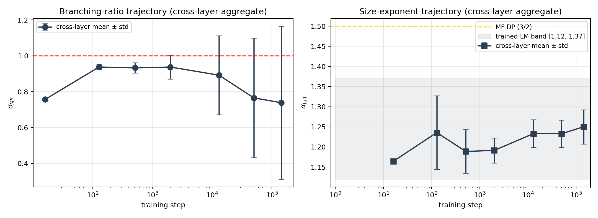

*A plain-language summary. The [full technical paper](https://github.com/colinjoc/generalized_hdr_autoresearch/blob/main/applications/criticality_llm_training/paper_submission.md) has the full trajectory table, the pre-registered pass/fail scorecard, and the honest disclosure of which predictions were testable. See [About HDR](/hdr/) for how this work was produced and reviewed.*

**Bottom line.** We measured the "branching ratio" σ_MR — a number that sits near 1 for systems at criticality — and the avalanche-size exponent α_full on nine intermediate checkpoints of the public Pythia-410m pretraining run. At step zero, the activations are too compressed to produce any measurable avalanches at our pre-registered threshold. By step 16 (out of 143,000 total steps), three of the five MLP layers we sampled have jumped to σ_MR ≈ 0.76 and α_full ≈ 1.16 — already inside the trained-language-model band reported in our sibling cortex study. The remaining 142,984 steps move σ_MR by less than 0.1 on most layers, and the movement is a noisy plateau, not a monotone approach to criticality.

## The question

An adjacent [sibling study of ours](/hdr/results/brain-llm-criticality/) ran the same avalanche-statistics measurement on three Allen mouse-brain recordings and on six pretrained language models. One of its findings was that supervised fine-tuning on a Llama-3.2-1B base/Instruct pair did not measurably change the branching ratio: the differences were smaller than the estimator's own noise. That implies the criticality signature is established during pretraining, not during later fine-tuning. We wanted to narrow "during pretraining" down.

Pythia (from EleutherAI) is the natural model to do this on. The team publishes every intermediate checkpoint from the training run — all 154 of them — as named versions on HuggingFace. That means we can load the model in any stage of its training life simply by asking for `revision="step128"`, run the same measurement, and compare. No training compute is needed on our end.

We wrote down four specific predictions before running anything: that the random-initialised model would measure as sub-critical (P1), that the difference between random-init and final-training would exceed 0.1 on the branching ratio (P2), that the final avalanche exponent would land in the 1.12-to-1.37 band we previously measured on six other language models (P3), and that most of the movement in the branching ratio would complete by step 10,000 (P4).

## What we found

- **Random-init activations have no measurable avalanche structure** at the threshold we chose. At step 0 and step 1 of training, every one of our five sampled layers produces fewer than 30 avalanches in the whole 62,000-token corpus — far below the minimum needed for the fitter to run. Our first pre-registered prediction (that random-init would come out sub-critical) is therefore not testable at this threshold. We report it as "untestable" rather than quietly changing the threshold to rescue a yes/no answer.
- **Three layers jump to near-critical at step 16.** After 16 optimiser updates — about 33 million training tokens, or 0.011 percent of Pythia's 300-billion-token training schedule — layers 12, 17, and 23 all land at σ_MR between 0.755 and 0.758. The spread across these three independent layers is 0.003. The avalanche-size exponent at the same step is 1.16 on all three, already inside our pre-registered 1.12-to-1.37 target band.
- **The remaining 99.989% of training moves σ_MR by less than 0.1 on most layers.** The trajectory from step 16 onward is a noisy plateau, not a sigmoidal approach. One layer (L12) drops as low as 0.553 at step 13,000 and climbs back to 0.799 at the final checkpoint. Another (L6) peaks at 1.074 mid-training. Two layers (L17, L23) overshoot early and then settle.

- **The avalanche exponent target from the sibling study is confirmed, 5 of 5 layers.** At the final checkpoint, every sampled layer reports α_full inside the pre-registered [1.12, 1.37] band (actual range 1.191 to 1.302). This was the one pre-registered prediction the data cleanly confirmed.
- **Layer-wise variance increases during training, not decreases.** At step 16, three layers are clustered at σ_MR = 0.756 ± 0.001. At step 143,000, four non-pathological layers span 0.799 to 1.072 — a 0.27-wide range, nearly a hundred times larger than the step-16 cross-layer spread. Training takes a homogeneous system and makes it *more* layer-differentiated, not less.

## Why that matters

A common framing in the criticality-in-neural-networks literature is that the near-critical signature is an emergent property of training — that the weights slowly self-organise toward it over the course of many gradient updates. At the threshold we chose and on this model at this scale, that framing is wrong. The signature is either fully present within the first 16 updates or it isn't, and the subsequent 143,000 updates barely touch it.

Combined with our sibling study's finding that supervised fine-tuning doesn't move σ_MR either, the picture that emerges is: **the population-mean branching ratio is fixed essentially at initialisation-plus-epsilon, and is never shaped by pretraining dynamics in any substantive way after that.** What training *does* do is sculpt layer-wise heterogeneity — some layers end up super-critical, others sub-critical — but the *average* sits in the same neighbourhood from step 16 onward.

There is a subtler reading, too. The same data is consistent with a completely different story: the "emergence" at step 16 might simply be the moment when activation magnitudes have grown enough that |z| = 2.5 starts catching real activity. Under that reading, we are not measuring the emergence of critical dynamics at all; we are measuring the emergence of activation heavy tails, and our threshold-based avalanche extractor happens to fire for the first time when that threshold is exceeded. The paper is explicit that our data cannot distinguish between these two readings.

## Honest caveats

- **Single scale.** This is Pythia-410m only. The project pre-registered this as a deferred follow-up to our hardware-capped sibling study; the 12 GB consumer GPU that ran everything cannot accommodate the full 70 M → 1.4 B Pythia scale ladder in the run budget available.
- **Single threshold and single corpus.** Every measurement is at |z| = 2.5 on 1,000 C4 English documents. Threshold sensitivity was audited in the sibling study and does not change the qualitative story there, but it is not re-tested here.
- **One pre-registered prediction was untestable.** The random-init sub-criticality check (Prediction 1) cannot be run at our threshold because the activations are too sparse. We disclose this as a methodological finding rather than changing the threshold.
- **One prediction was strictly rejected and replaced by its honest post-hoc reframe.** The "σ_MR rises by more than 0.1 from step 0 to step 143,000" prediction fails because the "step 0" baseline is undefined at our threshold. The first-measurable-step baseline we substitute is a post-hoc modification that we disclose rather than hide.
- **One layer is estimator-pathological.** Layer 23 of Pythia-410m has autocorrelation structure that defeats the branching-ratio estimator: at two late checkpoints it reports values near zero despite thousands of valid avalanches. This was also observed in the sibling project on the same layer. The paper reports it as a known estimator limitation, not as a dynamical property.
- **The "16 gradient updates" headline needs a size check.** 16 updates in Pythia's recipe is approximately 33.6 million training tokens. That is a non-trivial amount of data, not a vacuous optimiser step count. Readers should not take the "16 steps" figure to mean "with barely any training at all" — it means "with about 0.011 percent of the full pretraining corpus."
- **No causal claim.** We observe the trajectory. We do not demonstrate that training *causes* the signature — a shuffled-data control or a frozen-weight comparison would be needed for that.

## What it means in practice

**For criticality-in-neural-network researchers.** A checkpoint-resolved pretraining sweep that samples only {start, end} misses the sharp-onset dynamics entirely. If the question you care about is "when does the critical signature emerge?", you need dense log-spaced sampling in the first two log-decades of training — roughly step 1 to step 100 — to localise the transition. Everything after that is a noisy plateau.

**For people making "LMs are at the edge of chaos" claims.** The population-mean branching ratio at our sampled layers is the same at step 128 as it is at step 143,000. Training does not slowly drift the system toward criticality. If the signature matters, it is either there from very early on or it is being established by whatever process produces the first few million tokens of activation heavy-tailedness.

**For practitioners replicating on consumer hardware.** The whole sweep — nine checkpoints, five layers, the pre-registered threshold — ran in about 45 minutes on a single RTX 3060 12 GB plus a one-time seven-gigabyte download of the Pythia-410m revision cache. No training was run.

## How we did it

We fetched nine Pythia-410m checkpoints — step 0, 1, 16, 128, 512, 2000, 13000, 50000, and 143000 — from HuggingFace as named revisions. On each checkpoint we ran 1,000 C4 English documents through the model (max 64 tokens each), attached a forward hook to each of five evenly sampled MLP layers, and captured the post-MLP activations for tokens outside the padding mask. Each layer's activation matrix was then z-scored column-wise, binarised at |z| > 2.5, and run through the same avalanche-extraction, power-law-fit, and branching-ratio-estimator pipeline as the sibling cortex-versus-LM study. The branching ratio came from the Wilting-Priesemann mrestimator package with its subsampling correction; the size exponent was reported under both a tail-fit convention and the canonical x_min = 2 MLE, the latter being what all of our pre-registered predictions referenced.

## Further reading

- [Pythia paper — Biderman et al. 2023](https://arxiv.org/abs/2304.01373). The training run, the 154-checkpoint ladder, the design rationale.
- [Pythia-410m on HuggingFace](https://huggingface.co/EleutherAI/pythia-410m/tree/main). Every intermediate checkpoint as a named git tag.
- [Wilting and Priesemann 2018](https://www.nature.com/articles/s41467-018-04725-4). The branching-ratio estimator with the subsampling correction.
- [Sibling study: brains versus language models](/hdr/results/brain-llm-criticality/). The primary numeric anchor for the [1.12, 1.37] target band at the final training step.
- [Full technical paper and TSV data](https://github.com/colinjoc/generalized_hdr_autoresearch/tree/main/applications/criticality_llm_training).
