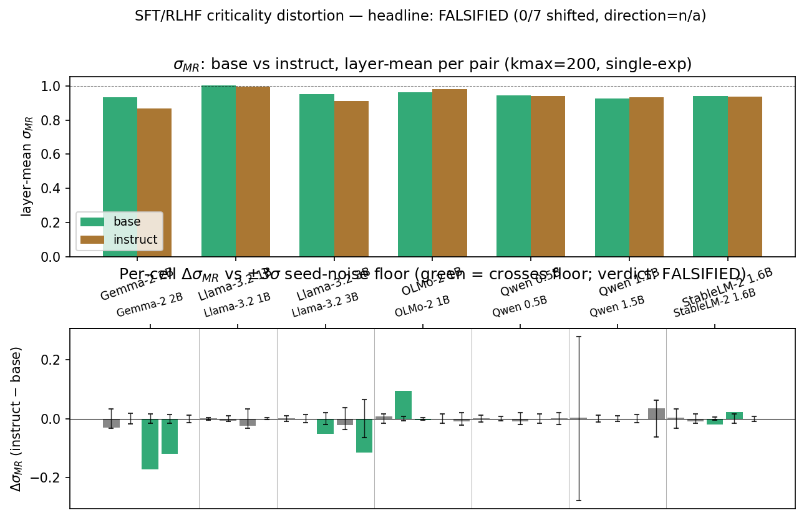

*A plain-language summary. The [full technical paper](https://github.com/colinjoc/generalized_hdr_autoresearch/blob/main/applications/criticality_sft_rlhf_distortion/paper_submission.md) has the per-cell tables, robustness sweeps, and the eight stated limitations. See [About HDR](/hdr/) for how this work was produced and reviewed.*

**Bottom line.** Instruction tuning (the post-pretraining step that turns a base language model into a chatbot, via supervised fine-tuning and either RLHF or direct preference optimisation) has well-documented effects on how a language model's activations are *spatially* arranged — the activation distribution becomes more anisotropic, with lower effective rank. We tested whether it also changes the *temporal* signature of those activations — the "criticality" branching ratio that neuroscientists use to characterise cortex — and across seven base/instruct pairs spanning four model families, the answer is no. Zero of seven pairs cross a noise threshold calibrated to each family's own seed-to-seed variability. The cross-family effect, if it exists at all, is bounded away from a 0.30 shift in the branching ratio. Static geometry and dynamical criticality dissociate.

## The question

A line of physics-of-the-brain work (Beggs and Plenz, 2003; Wilting and Priesemann, 2018) describes cortex as poised at a balance point — the "critical" regime — where avalanches of activity follow a power-law size distribution and a branching ratio (the average number of follow-up spikes per spike) sits close to one. Recent papers have reported the same kind of branching balance in trained neural networks, and our own [sibling work on Pythia](/hdr/results/pythia-criticality-onset/) traced when, during pretraining, that balance gets created.

A natural follow-up question is whether instruction tuning — the second phase of training that converts a "base" model into a chatbot — moves the balance. There are two reasons to expect it might. First, instruction tuning has well-documented effects on the static geometry of activations: anisotropy goes up, intrinsic dimension goes down, the next-token distribution sharpens (Aghajanyan et al., 2021; Razzhigaev et al., 2024). If the same training step also moved the temporal-correlation signature, that would be a clean cross-axis result. Second, several papers have attributed an "alignment tax" — where instruct models do worse on capability benchmarks than the base they came from — to layer-localised reweightings (Lin et al., 2024); those reweightings might leave a trace in the dynamical metric.

We tested seven base/instruct pairs at the 0.5-3-billion-parameter scale: Qwen2.5-0.5B, Qwen2.5-1.5B, Llama-3.2-1B, Llama-3.2-3B, Gemma-2-2B, OLMo-2-1B, and StableLM-2-1.6B. For each, we measured the same branching-ratio statistic on five evenly spaced layers across five random data-batch seeds, both before instruction tuning (the base) and after (the instruct variant).

## What we found

Across all seven pairs, no pair crosses the pre-registered threshold for a "shift". The threshold was the deliberate methodological move: rather than declare a shift if the branching ratio moved by some absolute amount (which would be apples-to-oranges across model families with different intrinsic noise), we measured each family's own seed-to-seed variability on the base side at each layer, and called a shift "real" only when the instruct-vs-base delta exceeded three times that within-family standard deviation, on at least three of five sampled layers, all in the same direction (either all collapse or all sharpen). For the headline to support a "systematic distortion" claim, at least three of the seven pairs would need to clear that bar with cross-pair direction agreement. Zero do.

<figure>
  
  <figcaption><strong>Figure 1.</strong> The instruct-minus-base shift in branching ratio at every (pair, layer) cell, plotted against that cell's noise floor. Cells inside the floor band are "not shifted"; cells outside cross the family-specific noise threshold. No pair has three or more crossings in a consistent direction; no pair is "shifted" under the locked criterion.</figcaption>
</figure>

The headlines:

- **Zero of seven pairs cross the locked threshold.** The two pairs closest to the bar — Gemma-2 2B and Llama-3.2 3B — each have exactly two collapse-direction layer crossings out of the required three. One additional crossing in either pair would have flipped them to "shifted (collapse)"; neither reaches it.
- **The verdict is robust to fit-form choice.** The branching-ratio estimator (the multistep-regression estimator of Wilting and Priesemann, 2018) exposes three different autocorrelation fit forms — single-exponential, complex-exponential, and exponential-offset. We re-ran the entire analysis under each. All three return the same FALSIFIED verdict, with zero shifted pairs in every form. The complex-exponential form is even more conservative than single-exponential — pairs with two crossings under single-exponential drop to zero under complex-exponential.
- **The verdict is robust to the analysis cutoff.** The estimator has a parameter (kmax) that controls how many lags of autocorrelation are fit. We swept that parameter across {100, 200, 500, 1000, 2000} on the base side; 31 of 35 cells move by less than 0.005 across the whole sweep, and at the four cells where the estimator is more sensitive, the actual delta between base and instruct is below 0.01 — so no per-pair determination flips.
- **There is a small sub-threshold lean toward collapse.** Five of the seven pairs have a small negative mean delta (collapse direction) across layers; two have small positive deltas. The mean of mean deltas is -0.013 with cross-pair standard deviation 0.029. Under a coin-flip null on direction, five-of-seven gives a p-value around 0.45 — not statistically distinguishable from random.
- **Bounded equivalence framing.** Under the [Lakens (2017)](https://journals.sagepub.com/doi/10.1177/1948550617697177) two-one-sided-tests (TOST) framing, the cross-family effect on the branching ratio is bounded away from a 0.30 shift at every pair. The largest single-cell delta is Gemma-2 2B layer 12 at -0.172, well inside that bound. This is not "no evidence at all" — it is "if there is an effect, it is small and bounded."
- **The companion power-law exponent agrees.** The avalanche-size exponent, the second criticality observable, sits in 1.21 ± 0.06 across all 175 base-side cells, and the cross-pair instruct distribution is statistically indistinguishable from the base distribution under a paired Kolmogorov-Smirnov test. Two independent observables, one verdict.

## Why that matters

Instruction tuning is not a small intervention. It changes how the model talks, what it refuses, how anisotropic its activation cloud is, and how peaky its next-token distribution becomes. There is a sensible prior that something this consequential at the behavioural level should also be measurable at the activation level on whatever observable you choose. The branching ratio is, on this evidence, the wrong observable to put on that list.

What the paper contributes is twofold. First, the negative finding itself: across seven publicly released base/instruct pairs spanning four model families and the 0.5-3-billion-parameter scale, the branching ratio doesn't move beyond the within-family seed-to-seed noise. The two observable families — static geometry and dynamical criticality — are evidently dissociable, and the criticality observable belongs to the "untouched-by-instruct-tuning" side of that dissociation. This is consistent with several pieces of theory: the wrapper-fine-tuning hypothesis (Jain et al., 2023), the low-intrinsic-dimensionality-of-fine-tuning result (Aghajanyan et al., 2021), and the KL-divergence-regularised structure of RLHF (Christiano et al., 2017; Ouyang et al., 2022) and DPO (Rafailov et al., 2023) all predict instruction tuning to be a small perturbation of the pretrained substrate, and our null is consistent with — though does not prove — that prediction at the temporal-criticality observable.

Second, the methodology. The per-family per-layer noise floor turned out to be the right comparison threshold to use. The within-family seed-to-seed standard deviation on the branching ratio varies by an order of magnitude across the seven pairs (from 0.001 at the tightest cells to 0.022 at the widest). An absolute-magnitude threshold (say, "a shift larger than 0.1 counts") would have flagged some pairs and missed others purely because of family-specific noise. The empirical floor absorbs that noise structure. The methodology is transferable: any cross-family criticality study, on any observable, can use the same recipe — measure the within-family seed noise on the baseline side, set the comparison threshold at three times that, require multi-layer direction agreement, pre-register the bar.

## What it means in practice

**For people studying instruction tuning at the activation level.** The branching ratio is not a useful diagnostic for whether instruction tuning changed anything, at least at the 0.5-3-billion-parameter scale and on multilayer-perceptron output activations. Anisotropy, intrinsic dimension, and effective rank are. The two observable families do different things and should be measured separately.

**For people doing cross-family criticality work.** The within-family seed-noise floor is the right threshold to use, and is much cheaper to measure than full bootstrapping (it only needs five base-side seeds at each cell). Without it, the cross-family signal cannot be separated from architecture-specific noise.

**For people interpreting null results.** A noise-controlled cross-family null on seven pairs is a stronger statement than a single-family null. The TOST equivalence framing (Lakens, 2017) lets you turn the null into a small-effect-bounded-away-from-zero finding, rather than the cleaner-looking but actually weaker "no evidence" framing.

## Honest caveats

- **Five seeds per cell.** That gives degrees-of-freedom four for the per-cell standard deviation — reasonable but not exhaustive. The two near-miss pairs (Gemma-2 2B and Llama-3.2 3B) each have exactly two layer crossings; a high-power follow-up on those two specifically, with twenty or more seeds, is the obvious next move.
- **0.5-3B parameter band only.** All the pairs we tested are in that range, because that is where open-weight base/instruct pairs were available at the time of writing. Whether the null extends to 7B-and-larger instruct variants is not tested.
- **One corpus, one activation site, one threshold.** All measurements use the [Colossal Clean Crawled Corpus](https://huggingface.co/datasets/allenai/c4), MLP-output activations, and a fixed activation z-score gate of 2.5 (the convention from the cortical-recording literature). Whether attention outputs, alternative gate values, or alternative corpora would produce a different cross-family pattern is not tested.
- **One outlier with a story.** A single seed at the Qwen-1.5B layer-0 cell returned a branching ratio close to 1.08 against 0.84-0.90 on the other four seeds, inflating that cell's noise floor by an order of magnitude. We document it in the paper as a known mrestimator failure mode at small autocorrelation timescale; a leave-one-out check excluding that seed does not flip the per-pair determination.

## How we did it

For each of fourteen models (seven base, seven instruct) we streamed 1,000 English documents from the Colossal Clean Crawled Corpus through the model and captured the multilayer-perceptron output activations on five evenly spaced layers using forward hooks. We did this five times per model with different random data batches (five seeds × fourteen models = seventy harvests). For each (model, seed, layer) cell we extracted "avalanches" of activity above a threshold (2.5 standard deviations above the per-cell mean) and computed two summaries: the branching ratio (the [Wilting and Priesemann](https://www.nature.com/articles/s41467-018-04725-4) multistep-regression estimator on the per-bin total-activity time series) and a power-law exponent on avalanche sizes ([Clauset, Shalizi, and Newman](https://epubs.siam.org/doi/10.1137/070710111) maximum-likelihood). The locked criterion (three-of-five layers crossing the per-cell three-sigma noise floor with consistent direction; three-of-seven pairs shifted with cross-pair direction agreement) was pre-registered before any instruct-side activations were harvested.

## Further reading

- [Wilting and Priesemann 2018](https://www.nature.com/articles/s41467-018-04725-4). The multistep-regression branching-ratio estimator with subsampling correction that this study uses.
- [Lakens 2017](https://journals.sagepub.com/doi/10.1177/1948550617697177). The two-one-sided-tests equivalence-test framing used here to turn the negative result into a bounded-effect finding.
- [Razzhigaev et al. 2024](https://aclanthology.org/2024.findings-eacl.58/). The cross-family static-geometry shifts (anisotropy, intrinsic dimension) that this paper does *not* find a temporal-correlation echo of.
- [Lin et al. 2024](https://aclanthology.org/2024.emnlp-main.35/). The "alignment tax" mechanistic analysis whose layer-localised pattern matches our two near-miss pairs at sub-threshold magnitude.
- [Sibling study: Pythia training-time criticality onset](/hdr/results/pythia-criticality-onset/). The training-trajectory study that this post-training comparison sits adjacent to.
- [Sibling study: brains versus language models](/hdr/results/brain-llm-criticality/). The cross-substrate study that the criticality protocol was inherited from.
- [Full technical paper, appendix and result tables](https://github.com/colinjoc/generalized_hdr_autoresearch/tree/main/applications/criticality_sft_rlhf_distortion).
