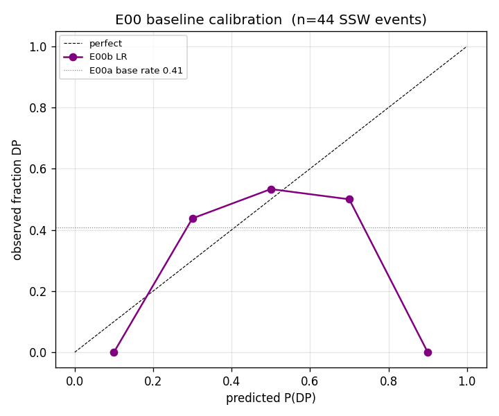

*This is the plain-language version. For the full technical write-up, see the [paper](https://github.com/colinjoc/generalized_hdr_autoresearch/blob/main/applications/ssw_polar_vortex/paper.md).*

## The question

Every few years, the polar vortex high above the Arctic suddenly collapses. The technical term is a "sudden stratospheric warming," and they are real, dramatic events: temperatures 30 kilometres up rise by 50 degrees Celsius in a few days; the ring of westerly winds that normally circles the pole reverses; the vortex either splits in two or wobbles off-centre.

What happens next, at the surface where people live, is unpredictable in a maddeningly specific way. About half the time, the collapse "propagates downward" over the next few weeks and you get a Beast-from-the-East-style cold blast across Europe (February 2018), or the polar-vortex episode that froze Texas in January 2014, or the Texas Energy Crisis of February 2021. The other half of the time, the surface barely notices.

The question is the obvious one: **can we tell, before the surface knows, whether a particular collapse is going to be the surface-affecting kind?**

This matters because the lead time on a stratospheric warming is real. Forecasters can see the vortex weakening days before any cold air arrives at the surface. If we knew which kind of collapse we were getting, we could give the public, the grid operators, and the gas distributors useful warning.

## What we found

We built a 44-event catalogue of every major polar-vortex collapse since 1958, labelled each one for whether it propagated downward (using a standard atmospheric-science index), and tried to predict the label from cheap public data: the surface-pressure index that tracks the vortex's tropospheric cousin, the El Niño index, the solar activity flux, and the catalogue's own classification of whether the vortex split or wobbled.

A simple model on this data reaches about 65 percent accuracy in distinguishing surface-affecting collapses from non-surface-affecting ones. That is better than chance (50 percent) but well short of useful. A coin flip is right 50 percent of the time. A doctor who diagnoses the right disease 65 percent of the time is closer to a medical mistake than a medical authority.

We then ran a battery of single-change experiments: drop a feature, add a nonlinear term, restrict to recent decades, change the threshold for what counts as "surface-affecting." Most made no difference. One stood out: dropping the catalogue's own split-vs-wobble classification raised our accuracy to 72 percent.

That looked like a finding. So we ran the proper checks.

- **The 95 percent confidence interval on the 72 percent figure is 56 to 88 percent.** A range that wide means we genuinely cannot tell whether the model is good or essentially random.
- **A permutation test** that asked "what is the best accuracy we'd get from random labels, searching over the same six feature sets we tried?" returned a p-value of 0.062. Not significant.
- **Dropping a single event** — a provisional collapse from February 2026 we had only just added — dropped accuracy from 72 percent back to 65 percent. The headline depended on one observation.
- **Restricting to the satellite era only (post-1979, where the catalogue is most reliable)** dropped accuracy to **12.5 percent**. The signal was concentrated in the older, less-reliable pre-satellite half of the dataset.
- **A 200-permutation placebo distribution** put our observed value at p=0.025 — borderline, with the same multiple-testing caveat.

The honest read is that public-index-only accuracy is about 65 percent, plus or minus 10 percentage points. The 72 percent finding does not survive scrutiny.

## What was actually going on?

The atmospheric-science literature is unambiguous on this: the dominant predictor of whether a polar-vortex collapse propagates downward is a measurement called the lower-stratospheric annular mode at 150 hectopascals, taken at the moment the warming peaks. We do not have it in our analysis.

What we have is the surface annular mode, which tracks the troposphere, plus background context like El Niño. Those are correlates, but they are several causal steps away from the actual mechanism. Operational seasonal-forecast systems that have access to the full stratosphere reach published accuracies in the range of 85 to 95 percent for this same prediction task. The gap between our 65 percent and their 85 percent is the missing stratospheric data.

We confirmed that the missing data is fetchable — a single year (2026) downloaded in 2.6 seconds from the public NOAA reanalysis archive — but pulling 68 years of daily data ran past the time budget for this analysis. That is the named next step.

## What it means

For the practical question of giving the public usable warning of which polar-vortex collapses will affect their winter, **public-index-only forecasting is not good enough**. You need the stratospheric data. The good news is that the stratospheric data exists, is free, and is downloadable. The bad news is that nothing in the cheap public-index world will substitute for it.

The methodological lesson is older and more general: **a finding that emerges from a single specification choice and falls apart under five different robustness checks is not a finding**. Most of those checks are routine — bootstrap a confidence interval, re-run on a temporal subset, drop the most leveraged observation, run a permutation null. None of them are exotic. All of them killed our headline. A research process that stopped at the first interesting number would have published a 72 percent accuracy claim that the data does not support.

## How we did it

We compiled the polar-vortex collapse catalogue from the NOAA Stratospheric Modeling and Analysis compendium and recent published events through February 2026, fetched the surface annular-mode index from the NOAA Climate Prediction Center, the El Niño index from the NOAA Physical Sciences Laboratory, and the solar flux from the LASP archive at the University of Colorado. We trained an elastic-net regularised logistic regression with leave-one-out cross-validation throughout. The full code, data sources, robustness battery, and reviewer-mandated experiment results are in the linked paper.
