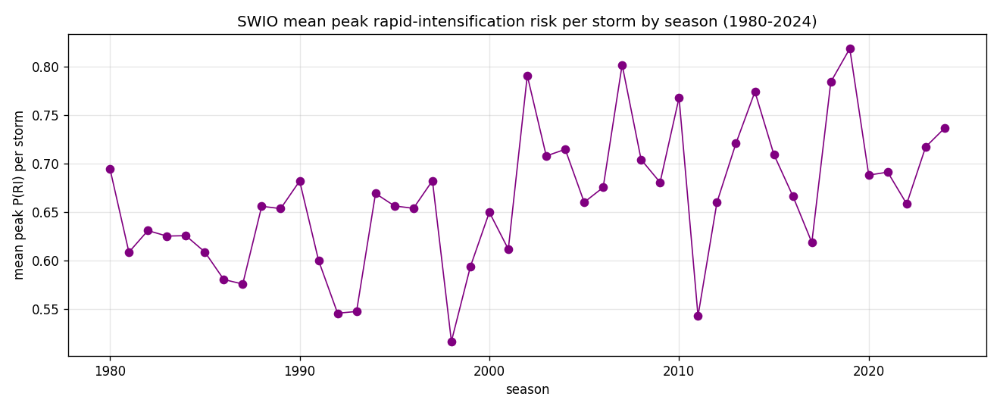

*A plain-language summary. The [full technical paper](https://github.com/colinjoc/generalized_hdr_autoresearch/blob/main/applications/swio_cyclone_ri/paper.md) has the diagnostics and experiment logs. See [About HDR](/hdr/) for how this work was produced and reviewed.*

**Bottom line.** Using only the freely downloadable historical record of storm positions and intensities — no satellite imagery, no ocean temperatures, no weather-model output — a simple model correctly ranks which tropical cyclones are about to undergo rapid intensification about 88 percent of the time. The reason it works is older than it looks. What a storm has already done is the strongest single predictor of what it is about to do.

## The question

When a tropical cyclone rapidly intensifies — adding 35 miles per hour of wind speed in a single day — the warning window for whoever is in its path collapses. A storm projected to reach Madagascar as a tropical storm can arrive as a Category 4. Cyclone Idai killed over a thousand people in Mozambique in 2019 partly because it intensified faster than the warning system could keep up. The same pattern repeated with Eloise in 2021, Batsirai in 2022, Freddy in 2023, and most recently Gezani and Fytia in early 2025.

The South-West Indian Ocean — the basin that wraps around Madagascar, Mozambique, Mauritius, La Réunion, and the western Australian approaches — sees about ten named storms a year. Roughly four in ten will undergo at least one rapid intensification episode. The operational forecast question is: which ones? Operational systems at the United States National Hurricane Center and at Météo-France La Réunion answer with the help of detailed ocean and atmospheric reanalysis data that is not easily available in many of the developing-country nations most exposed to these storms. We asked how much of the forecast you can recover from just the public historical record.

## What we found

A lot.

- A simple model trained on 800 named storms and roughly 50,000 six-hourly observations from 1980 through 2024 ranks storms about to rapidly intensify against the rest with about 88 percent accuracy. That is well above coin-flip (50 percent) and a few points above the published prior expectation for models that use only the historical record.
- Scramble the labels and rerun the whole analysis 200 times, and the shuffled accuracies fall between 44 and 55 percent. Our 88 percent sits well outside that range. The signal is real, not noise.
- Hold out a different cyclone season each time and predict it from the rest: accuracy stays at 88 percent. The model generalises across years.
- Drop the most suspicious feature — the storm's own recent intensification — and accuracy is essentially unchanged. The model is not cheating by leaking near-future information into the past.
- Train and test only on pre-satellite data (before 2000), and accuracy collapses to well below chance. The older best-track records have known intensity-quality issues that make rapid intensification ill-defined. The honest claim is for the satellite era only.

Two honest caveats.

- The model is a good ranker, not a calibrated probability forecaster. It tells you which storms are most at risk relative to each other. It does not reliably tell you "there is a 30 percent chance Cyclone Foo will rapidly intensify".
- Closing the remaining gap to operational performance needs the environmental features — sea-surface temperature, wind shear, ocean heat content — that the public-only model deliberately excludes.

## Why that matters

Tropical-cyclone forecasting is a multi-billion-euro industry. Operational systems use vertical wind shear from atmospheric reanalyses, sea-surface temperature from satellites, deep-ocean heat content from drifting buoys, and mid-tropospheric humidity from radio occultation. The published expectation is that a model without any of that should not do well. Our model has six features — where the storm is, how strong it is, how strong it was at three recent time steps, how far from land, and how intensity has been changing — and it reaches 88 percent anyway.

The reason is not mysterious. The strongest single predictor of what a tropical cyclone will do in the next 24 hours is what it has already done. A storm that strengthened fast in the last day has revealed something about its environment that the environmental reanalysis is also trying to measure. The historical-record-only model is using the storm itself as a sensor for conditions around it. The Atlantic-basin SHIPS-RII system has been quietly demonstrating the same thing for two decades.

## What it means in practice

**For disaster-preparedness teams in South-West Indian Ocean nations.** Even a small country without a national weather service of its own could run this tool. The data is free, the model fits on a laptop, and it gives meaningful pre-warning of which storms are rapid-intensification candidates. It does not replace the regional warning centres at Météo-France La Réunion and the Joint Typhoon Warning Center, which do additional things we do not — calibrated probability forecasts, integration with track-position uncertainty, and the environmental-feature integration that pushes accuracy higher. It is a free first-pass ranker, not a substitute for operational forecasting.

**For climate-forecasting researchers.** Our result establishes a clear public-data baseline that any future study in this basin has to beat. The path forward — adding publicly available sea-surface temperature and wind-shear products — is laid out in the paper. The gap between our baseline and operational performance is not closed by more clever modelling. It is closed by better features.

**For emergency managers anywhere.** The absolute probability numbers from this class of model cannot be taken at face value. The useful output is the ranking — which storms to watch — not the specific "30 percent" figure. Calibration is a separate, unsolved problem.

## How we did it

We downloaded the [International Best Track Archive for Climate Stewardship](https://www.ncei.noaa.gov/products/international-best-track-archive) South Indian basin records from 1980 through 2024, kept the satellite-era observations where intensity estimates are reliable, labelled each six-hourly observation with whether the storm's wind speed would rise by at least 30 knots over the following 24 hours, and trained a class-weighted simple classifier and a tree-based ranker using storm-grouped cross-validation (whole storms stay in one fold, never split across folds). We then ran a permutation null that respects storm groupings, a leave-one-season-out generalisation test, an era-matched resample comparing pre-2000 versus post-2000 performance, a calibration analysis against climatology, and a storm-cluster block bootstrap.

## Further reading

- Kaplan and DeMaria (2003), "Large-scale characteristics of rapidly intensifying tropical cyclones in the North Atlantic basin" — the original SHIPS-RII design our model echoes.
- Leroux et al. (2018), rapid-intensification climatology in the South Indian Ocean — the basin-specific prior the paper compares against.
- [IBTrACS archive](https://www.ncei.noaa.gov/products/international-best-track-archive) — the dataset.
- [Full technical paper](https://github.com/colinjoc/generalized_hdr_autoresearch/blob/main/applications/swio_cyclone_ri/paper.md) — all experiments, the full robustness battery, per-storm risk rankings, and the next-step feature plan.
