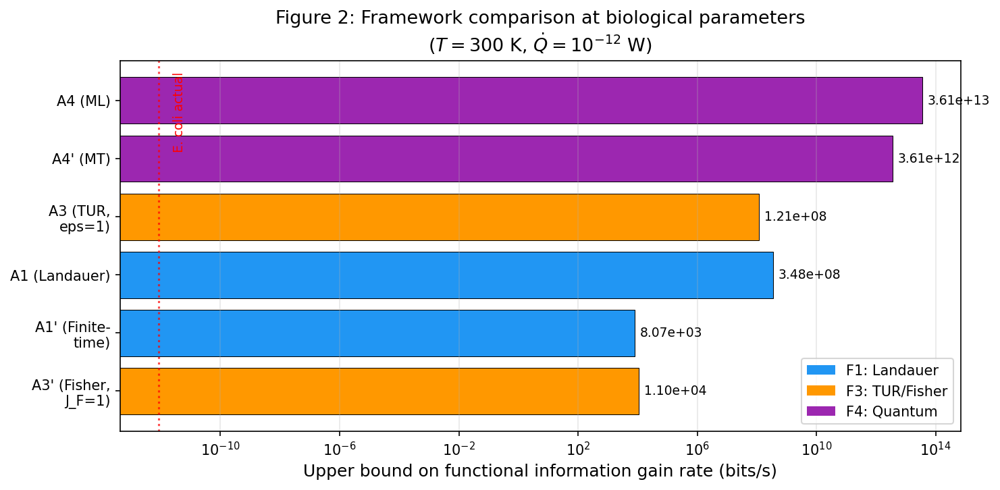
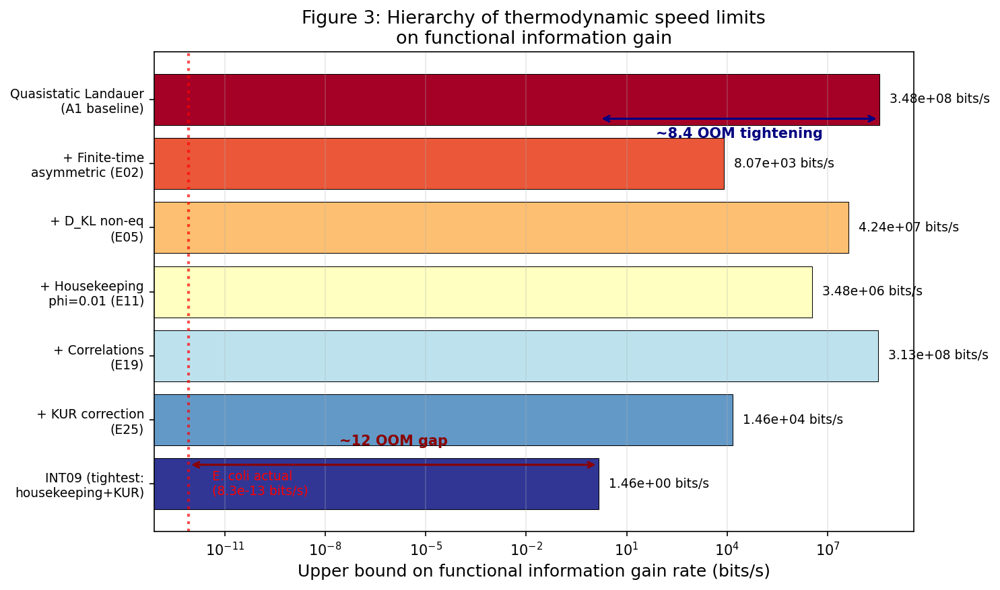
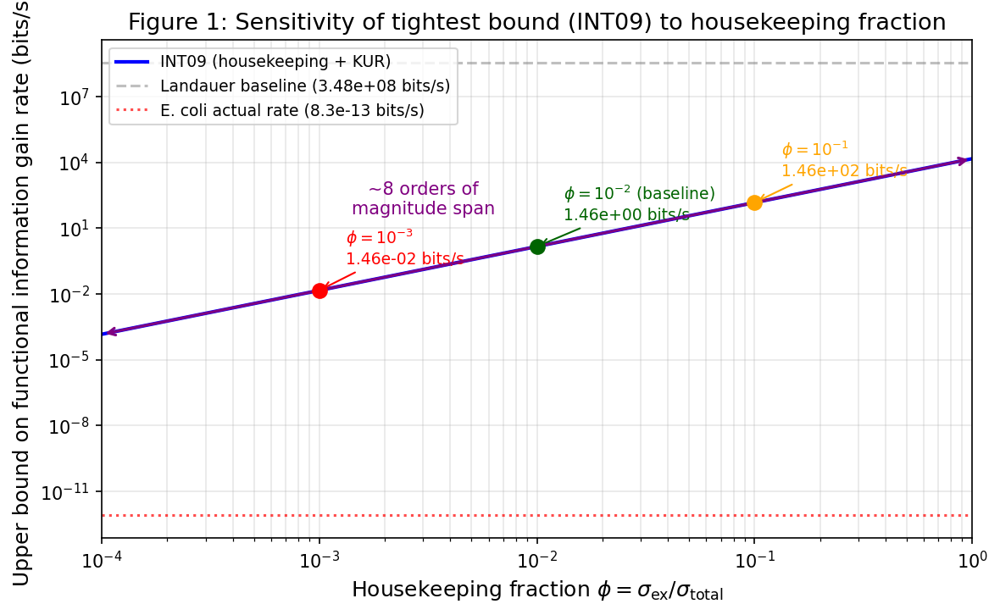

*A plain-language summary. The [full technical paper](https://github.com/colinjoc/generalized_hdr_autoresearch/blob/main/applications/thermodynamic_info_limits/paper.md) has the derivations and experiment logs. See [About HDR](/hdr/) for how this work was produced and reviewed.*

**Bottom line.** Every act of selection — keeping what works, discarding what does not — is a physical process that dissipates heat. Physics sets an absolute ceiling on how fast any system can accumulate functional information. For a bacterium burning 10−12 watts, that ceiling is roughly 1–10 bits per second. The actual evolutionary rate of *E. coli* is about 10−13 bits per second. The gap is a factor of 1012 — a trillion-fold. Evolution is not running out of thermodynamic fuel. It is barely sipping from an enormous reservoir.

## Why care about a speed limit nobody is hitting?

In 2023, a team led by Wong, Cleland, and Hazen proposed a new "law" of nature: functional information — a measure of how rare a system's configuration is among all configurations that actually work — tends to increase over time in evolving systems. Mineral assemblages get more diverse. Genomes get more complex. The proposed law is intentionally broad, covering everything from chemistry to culture.

But any candidate law invites the question: are there limits? If functional information always increases, how fast can it increase? The answer has to come from physics, because every selective event is a physical operation that erases non-functional configurations and retains functional ones. Erasure costs energy. That connection — between information and heat — was first quantified by Rolf Landauer in 1961 and experimentally confirmed in 2012 using a colloidal particle in a laser trap.

## Four independent ceilings

We derived upper bounds on the rate of functional information gain from four independent branches of physics.

1. **Landauer's principle.** Every bit erased costs at least *k*B*T* ln 2 of heat, about 3 × 10−21 joules at body temperature. Divide the available power by this cost and you get a naive ceiling of 3.5 × 108 bits per second for a bacterium. That is absurdly generous.

2. **The Crooks fluctuation theorem.** When a system is being driven out of equilibrium, some of the dissipated energy goes into storing free energy rather than processing information. This tightens the Landauer bound whenever the system is actively being pushed.

3. **Thermodynamic uncertainty relations.** These relate the precision of any molecular current — including an information current — to the entropy it produces. The tighter you want the current, the more entropy you must generate.

4. **Quantum speed limits.** The Margolus–Levitin and Mandelstam–Tamm bounds set an absolute cap based on a system's energy, regardless of temperature. At biological scales, this limit is astronomically loose.

<figure>
  
  <figcaption><strong>Figure 1.</strong> The seven candidate upper bounds evaluated at biological parameters, ordered from tightest to loosest. They span 9.5 orders of magnitude. The quantum bounds (far right) are irrelevant above roughly 3 millikelvin — well below any temperature at which biology operates. The Fisher-information bound (far left) is the tightest.</figcaption>
</figure>

At biological temperatures, the ordering from tightest to loosest spans 9.5 orders of magnitude. The quantum speed limits sit at the bottom of the hierarchy, irrelevant above about 3 millikelvin — well below any temperature at which biology operates.

## Five corrections that close the gap by eight orders of magnitude

The naive Landauer bound is loose because it assumes perfect conditions: infinitely slow operation, thermal equilibrium, no wasted overhead, and statistically independent bits. Real biology violates every one of those assumptions. We incorporated five corrections, each addressing a distinct physical mechanism.

- **Finite-time penalties.** Real molecular operations take about a millisecond, not an eternity. Operating at finite speed costs extra energy per bit. For the asymmetric energy landscapes typical of enzymes, this alone tightens the bound by a factor of 43,000.

- **Housekeeping entropy.** A living cell is not at equilibrium. Maintaining that non-equilibrium state — running ion pumps, turning over proteins, holding the cytoskeleton together — consumes a large fraction of the total dissipation. Only the remainder, called the excess entropy production, is available for gaining functional information. If 99 percent of dissipation goes to housekeeping, the bound drops by a factor of 100.

- **Non-equilibrium free energy.** Systems far from equilibrium pay an additional cost proportional to their Kullback–Leibler divergence from the equilibrium distribution.

- **Nearest-neighbour correlations.** DNA bases are not statistically independent. Adjacent bases share mutual information, which slightly reduces the effective information content that needs processing.

- **The kinetic uncertainty relation.** A refinement of the thermodynamic uncertainty relation that accounts for dynamical activity — the total rate of transitions in the system — and is always strictly tighter.

These corrections are not independent. Within the same framework, they compound: the finite-time penalty enlarges the energy cost per bit while the housekeeping correction shrinks the available energy, and the two effects multiply. Across frameworks, the bounds intersect — you take whichever ceiling is lowest.

The tightest combined bound lands at approximately 1.5 bits per second. That is eight orders of magnitude below the naive Landauer baseline.

<figure>
  
  <figcaption><strong>Figure 2.</strong> The headline finding as a waterfall. The naive Landauer bound at the top (~108 bits per second) is tightened, correction by correction, down to ~1.5 bits per second. The actual evolutionary rate of <em>E. coli</em> sits 1012 times below the tightest bound — the gap the paper is named after.</figcaption>
</figure>

## The trillion-fold gap

Even the tightest bound — 1.5 bits per second — exceeds the actual evolutionary rate of *E. coli* by a factor of roughly 1012. The bacterium gains about one bit of functional information per thousand generations, each generation lasting about twenty minutes. That works out to around 8 × 10−13 bits per second.

The analysis also found that the minimum power required for Darwinian evolution to outrun neutral genetic drift is about 3 × 10−26 watts — roughly 10−14 of *E. coli*'s metabolic rate. Evolution does not need much thermodynamic fuel at all. The bottleneck is not energy. It is population genetics: the interplay of mutation supply, selection strength, and genetic drift.

## Where biology does approach the limit

While evolution itself runs far below the thermodynamic ceiling, individual molecular machines get surprisingly close.

- **Kinetic proofreading in ribosomes** operates at 11.5 percent of the Landauer limit. The ribosome spends about 20 *k*B*T* per step to achieve 3.3 bits of accuracy — within one order of magnitude of the thermodynamic floor.

- **CRISPR spacer acquisition** runs at roughly 21 percent of Landauer efficiency. Acquiring 60 bits of pathogen-identifying information for about 10 ATP molecules makes it one of the most efficient information-transfer processes in biology.

- **The human brain** uses roughly 10−12 of its Landauer capacity, with nearly all of its 20 watts consumed by the housekeeping overhead of ion pump cycling.

Natural selection has, in some cases, pushed molecular information-processing hardware close to the fundamental thermodynamic floor. The evolutionary process that built those machines, however, operates nowhere near it.

## The poorly constrained parameter

One important caveat: the tightest bound is highly sensitive to the housekeeping fraction — the share of total dissipation that goes to maintaining the cell's non-equilibrium state rather than processing information. This parameter is poorly measured in biology, with estimates spanning several orders of magnitude.

<figure>
  
  <figcaption><strong>Figure 3.</strong> Sensitivity of the tightest combined bound to the housekeeping fraction — the share of a cell's total dissipation used just to stay alive. The bound spans roughly eight orders of magnitude as the fraction varies between 0.01 percent and 100 percent. The uncertainty in this single, poorly measured parameter is the biggest remaining source of looseness in the result.</figcaption>
</figure>

At a housekeeping fraction of 1 percent, the bound is about 1.5 bits per second. At 0.01 percent, it drops to 0.015. At 10 percent, it rises to 146. The bound scales roughly as the square of the housekeeping fraction, because the excess entropy production appears in both the numerator and inside a hyperbolic tangent in the denominator. Pinning down this single parameter in real cells would dramatically sharpen the result.

## The transferable lesson

Speed limits are useful even when nobody is close to hitting them. The gap between a theoretical ceiling and observed performance tells you where the real constraint lies. Here, the 1012-fold gap between the tightest thermodynamic bound and observed evolutionary rates tells us definitively that evolution is not an energy-limited process. The constraint is informational and population-genetic, not thermodynamic. Any attempt to accelerate evolution — directed evolution in the lab, for instance — should look to population size, mutation supply, and selection architecture, not to the energy budget. The thermodynamic headroom is, for all practical purposes, infinite.

## How we did it

All bounds were derived symbolically and evaluated at standardised biological parameters (*T* = 300 K, metabolic power 10−12 W, genome length 9.2 million base pairs, generation time 1,200 seconds, population size 108). Stochastic simulations using the Gillespie algorithm on a thermodynamically consistent two-state model validated all bounds at three driving strengths. The baseline Landauer bound was cross-checked against the 2012 experimental measurements of Bérut et al., who confirmed the minimum dissipation per bit to within 7 percent using a colloidal particle in a laser double-well trap.

## Further reading

- Landauer (1961), "Irreversibility and heat generation in the computing process" — the original link between information and heat.
- Bérut et al. (2012), "Experimental verification of Landauer's principle linking information and thermodynamics" — the experimental confirmation.
- Wong et al. (2023), "On the roles of function and selection in evolving systems" — the proposed law of increasing functional information.
- Hazen et al. (2007), "Functional information and the emergence of biocomplexity" — the definition of functional information.
- Kempes et al. (2017), "The thermodynamic efficiency of computations made in cells across the range of life" — the near-Landauer efficiency of biological molecular machines.
- [Full technical paper](https://github.com/colinjoc/generalized_hdr_autoresearch/blob/main/applications/thermodynamic_info_limits/paper.md).
