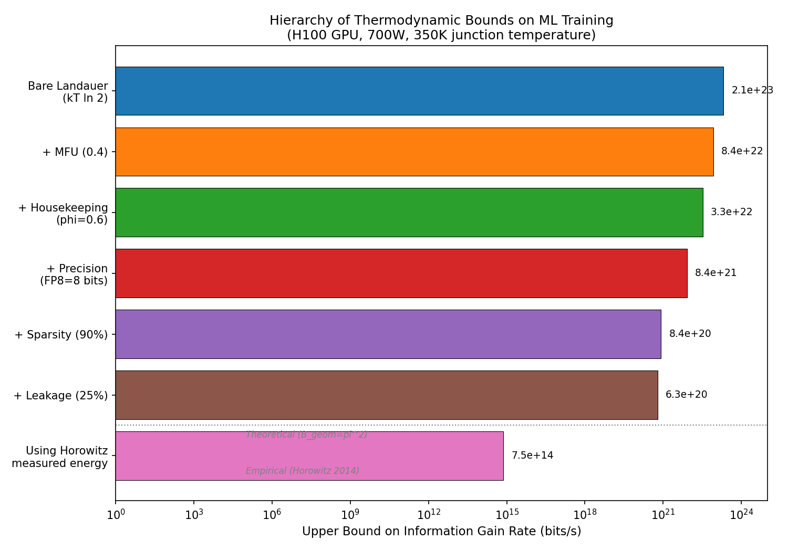
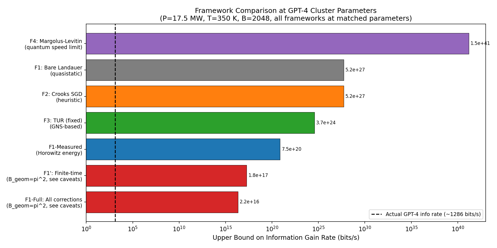
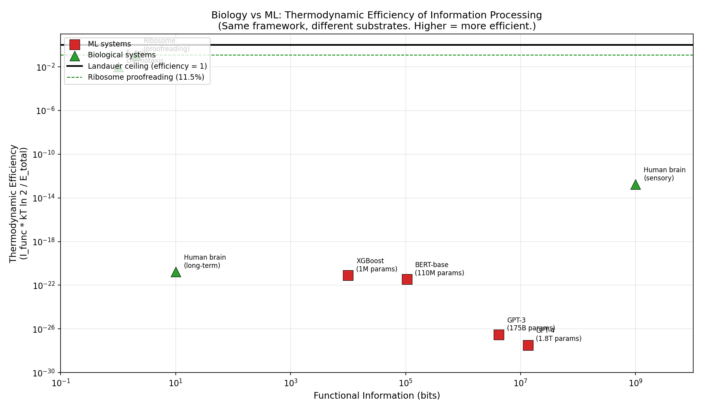

*A plain-language summary. The [full technical paper](https://github.com/colinjoc/generalized_hdr_autoresearch/blob/main/applications/thermodynamic_ml_limits/paper.md) has the derivations and experiment logs. See [About HDR](/hdr/) for how this work was produced and reviewed.*

**Bottom line.** Training a GPT-4-class model on twenty-five thousand GPUs at seventeen and a half megawatts is at least ten million times — and plausibly far more — above the thermodynamic ceiling for that operating point. The size of the gap depends sensitively on which bound you use and on three poorly measured parameters, and we report it as a range, not a single number. Two takeaways survive that uncertainty: today's ML training is not energy-limited by physics (economics and engineering bind first), and the gap grows with model scale rather than shrinking — larger models extract less knowledge per joule.

## Why would physicists care about GPU electricity bills?

Every time a GPU flips a transistor, it dissipates heat. In 1961, Rolf Landauer proved that erasing one bit of information requires dissipating at least *k*B*T* ln 2 of heat — about 3 × 10−21 joules at GPU junction temperature (350 K). This is not an engineering limit. It is a consequence of the second law of thermodynamics.

An NVIDIA H100 GPU running at 700 watts can in principle process 2 × 1023 bits per second at the Landauer limit. That number is absurdly generous — nobody would claim a GPU gains 1023 bits of useful knowledge per second during training. The interesting question is how generous, what closes the gap as you account for real hardware and real algorithms, and whether the framework for measuring all this will still mean anything when computing technology changes.

## Six corrections that eat into the headroom

The bare Landauer bound assumes ideal conditions: infinitely slow operation, perfect utilisation, no wasted overhead. Real GPU training violates every one of those assumptions. We assemble a taxonomy of six multiplicative correction factors:

1. **Model FLOPS utilisation (MFU):** Only 30–60 percent of the GPU's peak throughput goes to useful computation. The rest is pipeline bubbles and communication stalls.

2. **Data movement overhead.** A large fraction of chip power moves data between memory and compute units rather than performing arithmetic. For attention-heavy transformer workloads this share runs even higher.

3. **Mixed precision.** Training at FP8 instead of FP32 erases roughly four times fewer bits per parameter update.

4. **Sparsity.** If 90 percent of weights are zero, only the non-zero remainder needs updating.

5. **Static leakage.** About 25 percent of power at 4 nm is leakage current that does no computation at all.

6. **Finite-time switching.** Real transistors switch in nanoseconds, not infinitely slowly. Operating at GHz clock speeds in principle adds a large per-bit penalty — but the textbook formula for that penalty assumes Brownian motion in a double-well potential and overstates the cost for real CMOS by roughly 600-fold. We present results both with the theoretical penalty and with measured per-operation energy from Horowitz (2014), and recommend the measured numbers for any physically meaningful claim about CMOS.

Stacked together, these corrections plus the framework choice tighten the bare Landauer bound by a factor somewhere between 1010 and 1014. The width of that range is real, not a precision artefact: it is set by the uncertainty in the housekeeping fraction, in the gradient noise statistic that drives one of the bounds, and in the precision the model is trained at.

<figure>
  
  <figcaption><strong>Figure 1.</strong> The correction hierarchy for a 25,000-GPU cluster training a GPT-4-class model. The bare Landauer bound at the top (~1027 bits/s) is tightened, correction by correction. The corrected Landauer bound built on measured CMOS energy data — about 1020 bits/s — is the most physically meaningful ceiling. The actual functional information gain rate sits many orders of magnitude further below.</figcaption>
</figure>

## Four independent thermodynamic frameworks

We did not rely on Landauer's principle alone. Four independent branches of physics each set an upper bound on how fast training can gain useful information:

1. **Landauer's principle** (corrected): the energy cost of irreversible bit erasure.
2. **The Crooks fluctuation theorem**, adapted to stochastic gradient descent. Adapting Crooks to SGD this way is not a rigorous derivation — it is a physically motivated heuristic, valid for small learning rates and breaking down for large ones (we checked this directly with a Jarzynski-equality test on a quadratic landscape). Use it as a sanity-check estimate, not as a thermodynamic guarantee.
3. **The thermodynamic uncertainty relation**, reformulated using the Gradient Noise Scale of McCandlish et al. (2018). Naive applications of the uncertainty relation to ML training are circular: the bound depends on the variance of the very current it is trying to bound. The Gradient Noise Scale is independently measurable from gradient samples, which removes the circularity. This reformulation is the paper's single technical contribution.
4. **Quantum speed limits** (Margolus–Levitin): the maximum computation rate for a given energy. Vacuously loose for classical hardware — irrelevant for any near-term ML application — but included to complete the hierarchy.

<figure>
  
  <figcaption><strong>Figure 2.</strong> The hierarchy of thermodynamic bounds at the GPT-4 cluster operating point. The frameworks span more than twenty orders of magnitude. The corrected Landauer bound built on measured CMOS energy is the tightest meaningful ceiling for current hardware; the gradient-noise-scale uncertainty bound is a few orders of magnitude looser but is derived from a single physical principle with no free fitting parameters.</figcaption>
</figure>

All four frameworks agree on the qualitative conclusion: current ML training is nowhere near fundamental physical limits.

## How big is the gap, exactly?

The gap depends on which bound you trust and on a quantity that itself carries large uncertainty: the actual functional information gain rate of the trained model. We estimate the trained-model knowledge using three independent methods (description-length compression, PAC-Bayes bounds, and an extrapolation of the square-root scaling observed at smaller models), and the three agree only to within about three and a half orders of magnitude. That uncertainty propagates straight into the gap.

What we can say with confidence: even at the tightest meaningful ceiling, the gap is at least 107 for GPT-4-class training, and on plausible alternative parameter choices it widens to 1016 or more. Headline claims of "1020" sit inside this range but should not be quoted as a single number.

## The gap grows with scale

The most surprising finding is that larger models are less thermodynamically efficient, not more. Efficiency drops by roughly six orders of magnitude from XGBoost (106 parameters) to GPT-4-class systems:

| Model | Parameters | Knowledge per joule | Gap to Landauer |
|-------|-----------|---------------------|-----------------|
| XGBoost | 106 | 8 × 10−22 | ~1022 |
| BERT-base | 108 | 4 × 10−22 | ~1022 |
| GPT-3 | 1.8 × 1011 | 3 × 10−27 | ~1027 |
| GPT-4 est. | 1.8 × 1012 | 3 × 10−28 | ~1028 |

This happens because the useful knowledge encoded in a trained model scales roughly as the square root of parameter count (a regularity confirmed in three independent estimation methods), while training energy scales superlinearly. Doubling the model buys roughly forty percent more knowledge but costs more than double the energy.

## Biology does it better, per operation

We applied the same framework to biological information processing in a [companion project](/hdr/results/thermodynamic-info-limits/), enabling a direct cross-substrate comparison.

The ribosome — biology's protein-assembly machine — operates at 11.5 percent of the Landauer limit during proofreading. It spends about 20 *k*B*T* per step to gain 3.3 bits of accuracy. The most efficient CMOS arithmetic operation sits 106 above Landauer. CRISPR spacer acquisition lands at roughly 21 percent of Landauer efficiency.

<figure>
  
  <figcaption><strong>Figure 3.</strong> Thermodynamic efficiency across substrates, from the most efficient known biological process (ribosomal proofreading at 11.5 percent of Landauer) down through GPU-based ML training. The figure uses a single shared metric for portability across substrates; whether biology is "really" more efficient than ML depends on which information rate one credits the brain with, and that choice spans eight orders of magnitude on its own. Treat the table as raising the question, not answering it.</figcaption>
</figure>

The structural parallel between the two substrates is the more robust observation. In both cases, the dominant energy cost is housekeeping — keeping cells alive, keeping chips powered and data moving — rather than processing information. The path to higher efficiency in both domains points the same direction: shrink the share of energy spent maintaining state.

## What the gap tells practitioners

The thermodynamic limit is not the binding constraint on ML training today. Economics and engineering are. But the analysis localises where the largest opportunities sit:

- **The information gap.** Most floating-point operations during training produce intermediate results that are immediately overwritten. The ratio of total computation to functional information gained is the single largest factor. Algorithmic improvements — better optimisers, more efficient architectures, curriculum learning — attack this gap directly.

- **The hardware gap.** CMOS transistors dissipate 106 to 109 more energy per bit than the Landauer minimum. Neuromorphic and near-threshold designs close part of this gap; reversible computing in principle eliminates the irreducible Landauer cost for the linear operations that dominate neural-network FLOPs.

- **The overhead gap.** Model FLOPS utilisation, data movement, leakage, and precision together waste roughly a factor of one thousand of the hardware's nominal capacity. Kernel-level work like FlashAttention and processing-in-memory attacks this gap.

The paper offers one falsifiable prediction in this space: a 4-bit-precision, 99-percent-sparsity training run on H100-class hardware should achieve a knowledge-gain rate within a factor of about 200 of an FP8 / 90-percent-sparsity baseline, with the ratio set by the product of the precision and sparsity correction factors. A measured ratio outside the range 100–400 would falsify the multiplicative-stacking assumption that the whole framework rests on.

## Why publish a framework for a non-binding limit?

The bounds in this paper are 107 or more above today's training rate — the laws of physics are not what is stopping the next training run. The case for assembling them anyway is forward-looking. At the 105–106 efficiency-improvement horizon projected by Koomey-law extrapolations, near-threshold CMOS, photonic accelerators, and neuromorphic chips, the thermodynamic ceiling does start to bind. We treat this paper as a calibrated reference tool: a framework that can be dropped onto any future compute substrate, with measurable inputs at every step, and used to compute the gap between observed and Landauer-limited information gain rate. Today the gap is huge. The interesting question is when it stops being.

## How we did it

All bounds were derived analytically and evaluated at standardised operating points (a single H100 at 700 W and 350 K junction temperature, and a 25,000-GPU cluster at 17.5 MW). Six multiplicative correction factors were applied independently and in combination, with sensitivity analysis across all of them. The TUR bound was reformulated using the Gradient Noise Scale (McCandlish et al. 2018) to resolve a circular dependency in prior formulations. Functional information estimates use three independent methods (description-length compression, PAC-Bayes, square-root scaling) whose 3.6-orders-of-magnitude spread propagates to all efficiency calculations. The Crooks-derived bound for SGD was checked for its range of validity using a Jarzynski-equality test on a 50-dimensional quadratic landscape. All energy values come from published specifications rather than direct measurement; the paper is an analytical survey, not an empirical study.

## Further reading

- Landauer (1961), "Irreversibility and heat generation in the computing process" — the original information-heat link.
- Horowitz (2014), "Computing's energy problem" — measured CMOS energy per operation.
- Koomey et al. (2011), "Implications of historical trends in the electrical efficiency of computing" — the trajectory toward Landauer.
- Goldt and Seifert (2017), "Stochastic thermodynamics of learning" — the formal connection between thermodynamics and neural network training.
- McCandlish et al. (2018), "An empirical model of large-batch training" — the Gradient Noise Scale used in the reformulated uncertainty bound.
- Proesmans, Ehrich, and Bechhoefer (2020), "Finite-time Landauer principle" — the finite-time correction whose CMOS applicability we examine and qualify.
- [Full technical paper](https://github.com/colinjoc/generalized_hdr_autoresearch/blob/main/applications/thermodynamic_ml_limits/paper.md).
- [Companion biology project: How fast can evolution actually go?](/hdr/results/thermodynamic-info-limits/)
