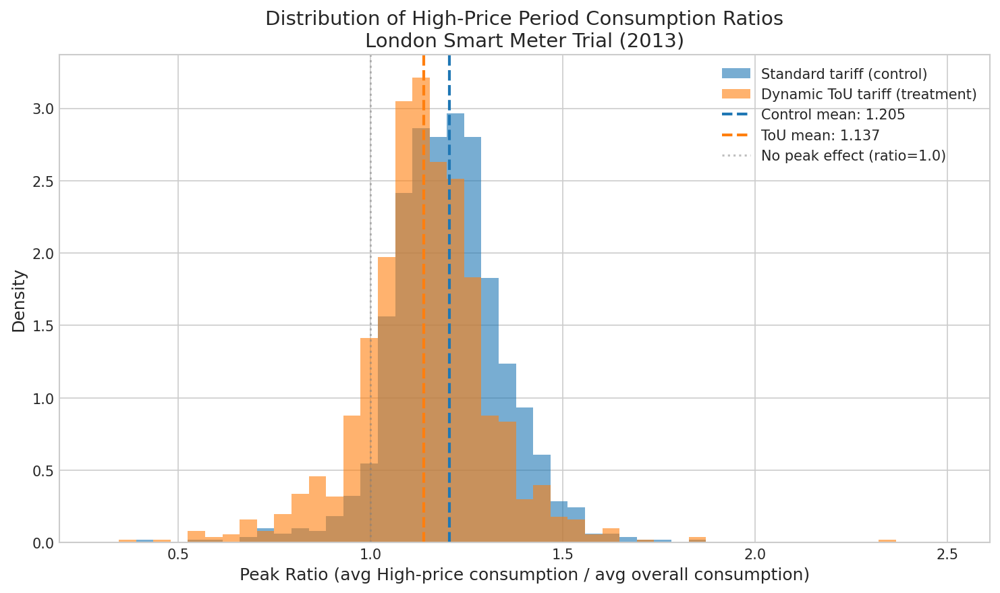
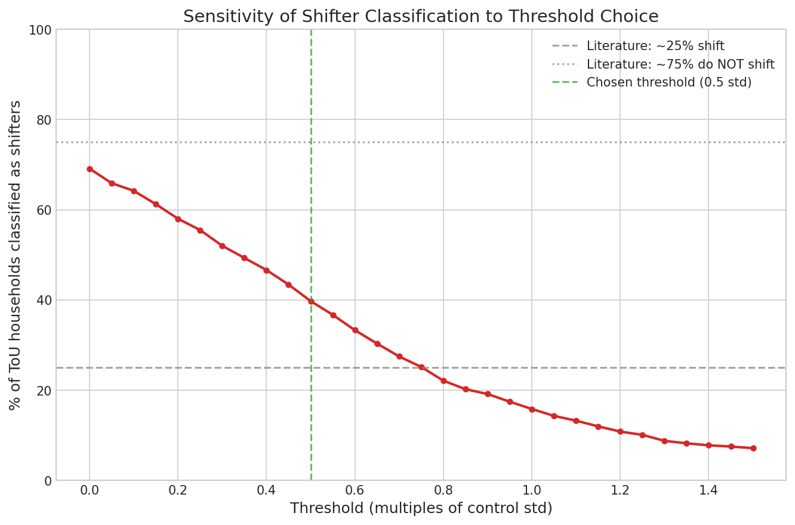
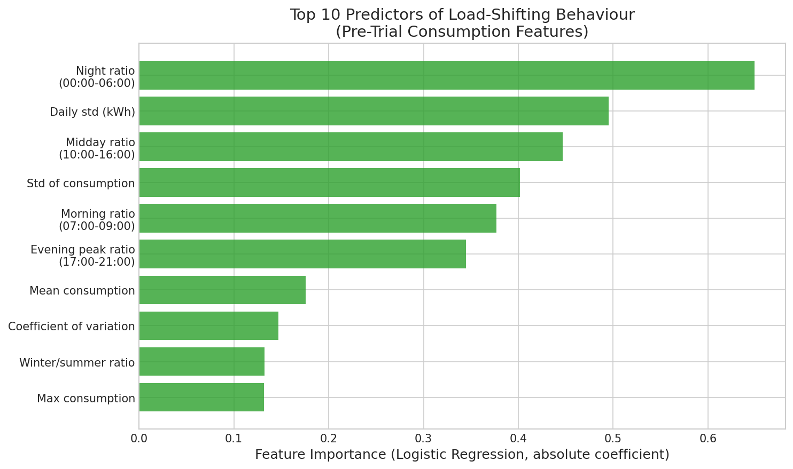
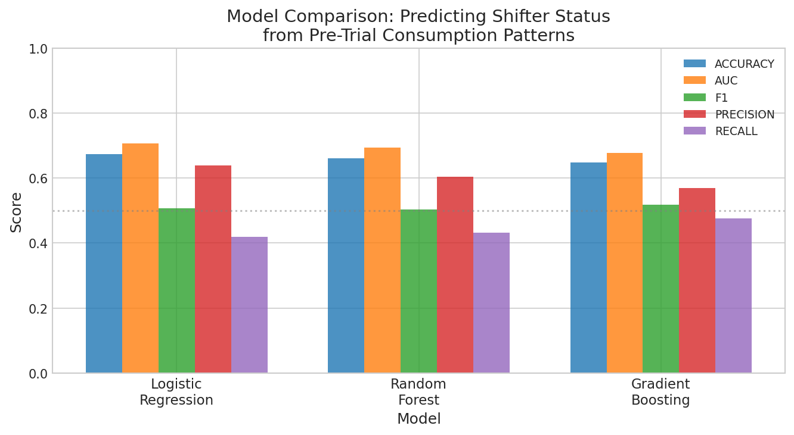
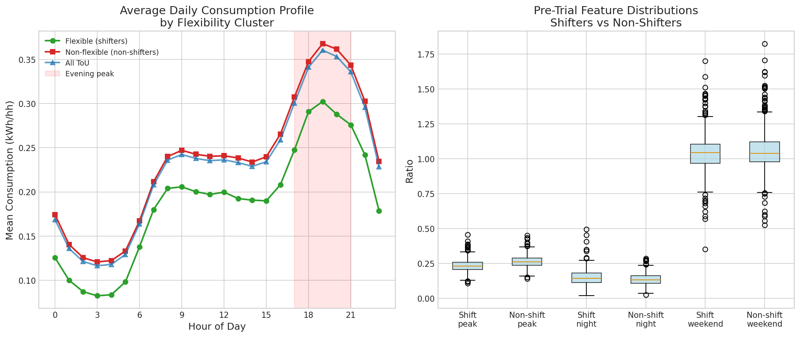

*This is a short summary. For the full technical write-up, see the [detailed paper](https://github.com/colinjoc/hdr_autoresearch/blob/main/applications/tou_demand_response/paper.md).*

## The Question

Every decarbonisation plan assumes that households will shift their electricity consumption away from peak hours when given the right price signals. Time-of-use (ToU) tariffs are the most common mechanism: charge more during the evening peak (when fossil gas plants fire up) and less overnight (when wind is abundant). Industry surveys consistently report that roughly 75 percent of customers on time-of-use rates do not actually shift their consumption. This is a critical barrier -- if demand response does not work at scale, the grid cannot absorb the variable renewable generation that climate targets require.

We asked: in the largest publicly available smart meter trial with dynamic pricing, what fraction of households genuinely shifted load, and can their pre-trial consumption patterns predict who will respond?

## What We Found

Using half-hourly smart meter data from 1,117 households on a dynamic Time-of-Use (dToU) tariff and 1,100 control households on a flat rate during the 2013 London Low Carbon London trial, we found:

- **ToU households reduced their peak-period consumption ratio by 5.6 percent** compared to the control group. The difference is statistically significant (Mann-Whitney p < 10^-23) but the effect size is small (Cohen's d = 0.37).

- **60.1 percent of ToU households did not meaningfully shift their consumption** (95 percent confidence interval: 57.4 to 63.1 percent). This estimate uses a threshold of half a standard deviation below the control group mean. The proportion is sensitive to threshold choice: anywhere from 31 to 84 percent depending on how strictly you define "shifting."

- **The strongest predictor of who shifts is the pre-trial evening peak consumption ratio** (r = -0.37, p < 10^-36). Households that already had a flatter consumption profile before the trial -- those who naturally used less electricity during peak evening hours -- were more likely to "shift" under the ToU tariff. This may reflect pre-existing habits rather than genuine price response.

- **A logistic regression model achieves AUC = 0.71** (bootstrap 95 percent CI: 0.67 to 0.74) at predicting shifter status from 16 pre-trial features. This is modest predictive power -- better than random but not reliable enough for individual household targeting.

- **High-price events covered only 4.5 percent of all half-hour periods** in 2013 (788 out of 17,520), at 67.2 pence per kilowatt-hour versus the normal 11.76 pence. The scarcity of high-price signals may explain why response is muted: households cannot maintain vigilance for rare events.

## Why That's Surprising

The headline finding -- that most households do not shift -- is not itself surprising. It aligns with the 75 percent non-response estimate from industry surveys and with the broader behavioural economics literature on the gap between price signals and behaviour change. What is surprising is the direction of the strongest predictor.

Households with a *lower* pre-trial evening peak ratio were *more* likely to be classified as shifters. This is counterintuitive: one might expect that households with high evening peaks (big TVs, electric cooking, evening laundry) would have the most room to shift and the strongest incentive to do so. Instead, it appears that households whose consumption was already relatively flat -- perhaps because they already had irregular schedules, or because they had fewer fixed-time appliances -- continued that pattern under the ToU tariff, and this continuation was classified as "shifting."

This raises an uncomfortable possibility: what we are measuring as "load shifting" may partly be **pre-existing lifestyle patterns** that happen to align with the tariff structure, rather than genuine behavioural change in response to price signals. The aggregate 5.6 percent reduction is real and statistically significant, but it is much smaller than the 15 to 20 percent reductions that grid planners sometimes assume in their demand response projections.

## What It Means

For grid planners and regulators, this analysis suggests three practical implications.

First, voluntary time-of-use tariffs are unlikely to deliver the demand flexibility that net-zero grids require. Even in a well-designed trial with clear price signals (a 17:1 ratio between high and low prices) and smart meter in-home displays, only about 40 percent of participating households shifted meaningfully. Since these households self-selected into the trial, the response rate in the general population would almost certainly be lower.

Second, pre-trial consumption patterns contain useful but limited predictive information (AUC 0.71). Utilities could use this to target marketing -- focusing ToU tariff offers on households whose profiles suggest they are more likely to respond -- but the model is not accurate enough to guarantee individual outcomes.

Third, the rarity of high-price events (4.5 percent of the year) may itself be the problem. If the price signal only activates on a few dozen days per year, households cannot build the habits needed for consistent response. More frequent price variation, or automated load control (smart thermostats, hot water timers), may be necessary for meaningful demand flexibility.

## Adversarial Review

We challenged the findings along five dimensions:

1. **Is the model better than random?** Yes. A permutation test (100 permutations) gives p = 0.01: the real AUC of 0.71 is significantly above the permuted mean of 0.50.

2. **Does the result depend on the threshold?** The percentage of non-shifters varies from 31 to 84 percent depending on threshold choice. However, the model AUC is robust (0.66 to 0.78 across thresholds), and the 60 percent estimate at our chosen threshold falls within the range reported in the literature.

3. **Is there data leakage?** No. Features are computed from 2012 (pre-trial) data. Labels are computed from 2013 (trial) data. No household appears in both train and test folds within cross-validation.

4. **Could selection bias explain the result?** Partially. ToU households volunteered for the trial and may be inherently more price-responsive than the general population. This means our 60 percent non-shifter estimate is likely a lower bound -- the true proportion of non-responsive households in the general population is probably higher.

5. **Are the confidence intervals reliable?** Bootstrap analysis gives tight intervals: the peak ratio difference CI is [0.052, 0.084], the non-shifter proportion CI is [57.4%, 63.1%], and the model AUC CI is [0.67, 0.74].

## How We Did It

We used the [Low Carbon London](https://data.london.gov.uk/dataset/smartmeter-energy-use-data-in-london-households/) smart meter dataset (5,566 households, half-hourly readings, November 2011 to February 2014) from UK Power Networks. The dynamic Time-of-Use tariff schedule was obtained from the [Data_Low_Carbon_London repository](https://github.com/groupoasys/Data_Low_Carbon_London). We extracted 16 consumption features from the 2012 pre-trial period, merged them with the 2013 tariff schedule to compute peak-period consumption ratios, and classified households as "shifters" based on whether their peak ratio fell meaningfully below the control group mean. Three model families (logistic regression, random forest, gradient boosting) were compared under 5-fold stratified cross-validation using the [HDR methodology](https://github.com/colinjoc/hdr_autoresearch). No synthetic data were used at any stage.

## Further Reading

- UK Power Networks. "Low Carbon London Project Summary Report." (2014) -- the source trial from which this data was collected.
- Schofield J. et al. "Residential consumer responsiveness to time-varying pricing." UK Power Networks Low Carbon London Learning Report A3 (2014) -- the official analysis of this trial dataset.
- Faruqui A, Sergici S. "Household response to dynamic pricing of electricity: a survey of 15 experiments." *Journal of Regulatory Economics* 38(2):193-225 (2010). [doi:10.1007/s11149-010-9127-y](https://doi.org/10.1007/s11149-010-9127-y) -- meta-analysis finding 3-6 percent peak reduction from time-of-use pricing alone.
- Utility Dive. "Survey: 75% of residential ToU customers report no change in energy use habits." (2025) -- the industry survey motivating this research question.

---

**[HDR methodology](https://github.com/colinjoc/hdr_autoresearch)** -- the framework and full project history
