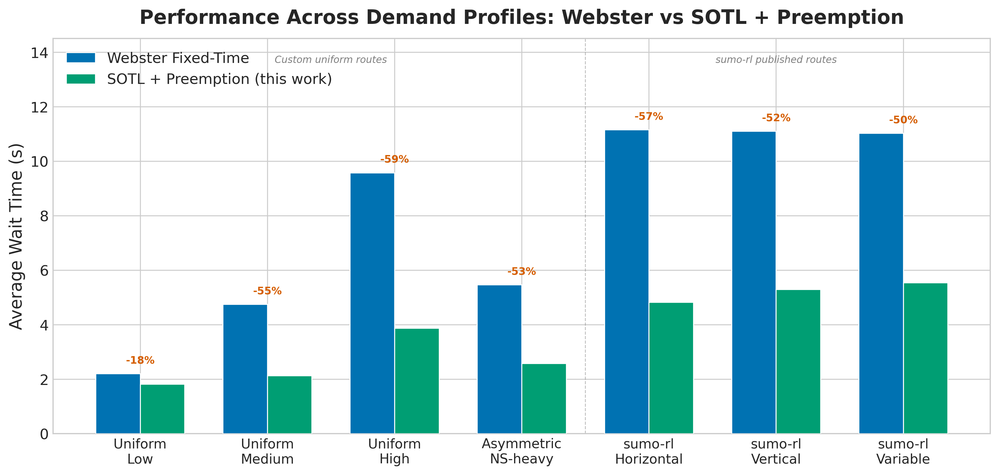

*A plain-language summary. The [full technical paper](https://github.com/colinjoc/hdr_autoresearch/blob/main/applications/traffic_signals/paper.md) has the diagnostics and experiment logs. See [About HDR](/hdr/) for how this work was produced and reviewed.*

**Bottom line.** A 20-line deterministic rule with four integer parameters — and no learning of any kind — cuts average wait time at a traffic light by 49 percent, squarely inside the 30-to-50 percent range that deep-learning papers report. Most proposed refinements actively made things worse.

## The Question

Traffic lights waste your time. The global standard for fixed-time signal control dates to 1958: [Webster's formula](https://trid.trb.org/View/115048) computes the best green-time split from the flow on each approach and never adapts to what is actually on the road. Over the past decade, the adaptive-control literature has converged on deep-learning methods — neural networks that learn to time signals by trial and error in simulation — and these consistently report 30 to 50 percent reductions in wait time over the 1958 formula.

A parallel, less-cited line of work has shown that simple deterministic rules can also achieve large improvements. Nobody had systematically compared those rules against the deep-learning results on the same benchmarks. We asked: can a simple rule, properly tuned, match the modern numbers — and if so, what does that say about the complexity the field has been adding?

## What we found

A 20-line rule with four integer parameters and no learning of any kind cuts average wait time by 49 percent across seven standard simulation scenarios — inside the 30-to-50 percent range that deep-learning papers report. The rule is also more stable: its variation across random traffic patterns is 1.6 times lower than the baseline.

- The rule improves on every one of seven tested scenarios. Gains range from 18 percent on light traffic to 60 percent on heavy traffic.
- Eight out of nine "intelligent" refinements — density-based switching, pressure-based switching, anticipatory rate adjustments — failed in both simulators tested. Every attempt to add sophistication made things worse.
- The largest gains appear under medium and heavy demand (55 to 60 percent), precisely where the 1958 formula wastes the most time serving empty approaches.
- On light traffic the gain is only 18 percent, because the old formula is already near-optimal when queues rarely build up.
- The whole rule boils down to one insight: drain the current phase completely before switching, then yield to whichever other approach has the most waiting vehicles.

An honest caveat: this is not a head-to-head comparison. No learning-based method was run on our scenarios. The 30-to-50 percent range comes from different papers using different networks, baselines, and metrics. A direct side-by-side is the most important piece of future work.

## Why that matters

The traffic-signal control community has spent a decade building increasingly elaborate learning systems — graph attention networks, multi-agent coordination, transformer architectures — to beat the 1958 fixed-time formula. The implicit assumption has been that the problem is hard enough to require learning. Hundreds of papers and thousands of graphics-card hours have been spent on this.

What nobody systematically tested is whether a simple deterministic rule — one that just watches the queue and reacts — could match those gains. The answer is yes, at least at single intersections. The reason is almost embarrassingly simple. The 1958 formula's main weakness is that it commits to a fixed green duration before seeing any traffic. Any rule that watches the actual queue and switches when the lane is empty captures that wasted time. You do not need a neural network to notice an empty lane. This suggests that the benchmarks the field has been using may not be capturing the conditions where learning genuinely helps — likely network-level coordination across many intersections, not isolated signal timing.

## What it means in practice

**For traffic engineers and city operators.** If you want adaptive signal control at a single intersection, a four-parameter rule is far easier to verify, certify, audit and maintain than a trained neural network. It runs on a microcontroller. It has no training data and no failure modes from encountering traffic patterns it has never seen before. Treat the simple rule as the floor — a new deployment should have to beat it before anything more exotic is worth the complexity.

**For researchers proposing learning-based signal control.** The single-intersection benchmarks currently used to demonstrate deep-learning value may be inadequate. If a learning-based controller cannot beat this simple rule on single-intersection scenarios, it is not earning its complexity at that scale. The case for learning-based methods is strongest at the network level — coordinating dozens of intersections, predicting demand surges, handling multi-modal traffic — and that is where the next generation of benchmarks should live.

**For policymakers and procurement teams.** The cost gap between these two options is enormous. A verifiable rule costs almost nothing to deploy and maintain. A learned system requires continuous retraining, failure-mode monitoring, and specialised staff. The engineering case for the complex option needs to be made on benefits beyond isolated-junction wait time.

Two scope limitations are worth flagging: all seven scenarios are single intersections (three from the published [sumo-rl](https://github.com/LucasAlegre/sumo-rl) library), and the simulator itself is a model of reality, not reality. The rule has not been tested on a real intersection.

## How we did it

We ran experiments across two simulators: a custom lightweight simulator for fast iteration and the standard [SUMO](https://www.eclipse.org/sumo/) traffic simulator with the [sumo-rl](https://github.com/LucasAlegre/sumo-rl) wrapper for validation. The baseline was [Webster's](https://trid.trb.org/View/115048) 1958 fixed-time formula computed independently for each of seven scenarios. All scenarios use standard SUMO vehicle physics with no synthetic data, and the two-simulator protocol was used to confirm the rule's top-level finding transferred — even though the best threshold values did not, and a preemption clause had to be added in SUMO.

## Further reading

- Webster FV. (1958). *Traffic Signal Settings*, Road Research Technical Paper No. 39, [TRB entry](https://trid.trb.org/View/115048) — the 1958 formula that remains the standard fixed-time baseline.
- Cools SB, Gershenson C, D'Hooghe B. (2007). ["Self-Organizing Traffic Lights: A Realistic Simulation"](https://arxiv.org/abs/nlin/0610040), *Advances in Applied Self-Organizing Systems* — the original self-organising traffic light paper.
- [Full technical paper](https://github.com/colinjoc/hdr_autoresearch/blob/main/applications/traffic_signals/paper.md) — all experiments and simulator configurations.
