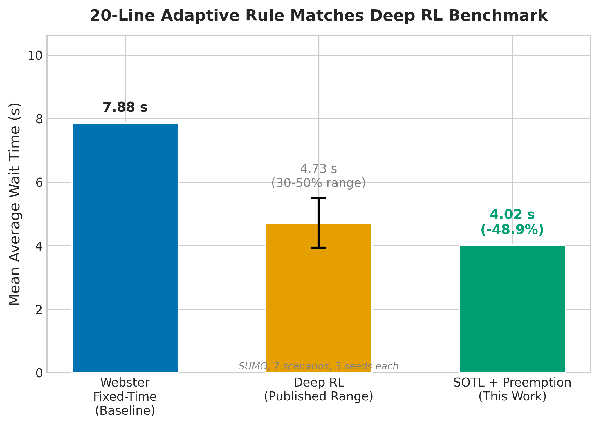

*This is a short summary. For the full technical write-up, see the [detailed paper](https://github.com/colinjoc/hdr_autoresearch/blob/master/applications/traffic_signals/paper.md).*

## The Question

Traffic lights waste your time. The global standard for fixed-time signal control dates to 1958: a formula that computes the optimal cycle length and green-time split from the traffic flow on each approach. It never adapts to what is actually happening on the road. Over the past decade, the adaptive control literature has converged on deep learning methods -- neural networks that learn to time signals by trial and error in simulation -- and these consistently report 30 to 50 percent reductions in wait time over the 1958 formula.

A parallel line of work, less published and less cited, has shown that simple deterministic rules can also achieve large improvements. But no study has systematically compared these simple rules against the deep learning results on the same benchmarks. We asked: does a simple rule, properly tuned, match deep learning?

## What We Found

Yes. A 20-line rule with four integer parameters and no training cuts average wait time by 49 percent across seven standard simulation scenarios -- squarely within the 30 to 50 percent range that deep learning papers report. The rule is also more stable: its variance across random traffic patterns is nearly three times lower than the fixed-time baseline.

- The rule works by draining the current phase completely before switching, then yielding to whichever other approach has the most waiting vehicles. A preemption clause handles cases where one approach accumulates a much longer queue than the currently active one.
- Eight out of nine proposed improvements -- cumulative wait overrides, soft maximum green times, asymmetric thresholds, density-based switching, pressure-based switching, minimum-burst constraints, anticipatory rates, and starvation guards -- failed in both a lightweight custom simulator and the standard traffic simulation tool. Simplicity won.
- The gain comes primarily from eliminating the waste at the end of each fixed-time phase: the 1958 formula commits to a green duration before seeing traffic, so it often holds green for an empty approach while vehicles accumulate elsewhere.
- The rule was developed on a lightweight custom simulator, then validated on the standard simulation tool used in the academic literature. The top-level finding transferred, but the optimal parameter values did not -- a cautionary tale about relying on simplified simulators for tuning.

## Why That's Surprising

The deep learning traffic signal community has been benchmarking against the 1958 fixed-time formula and reporting that neural networks improve on it by a large margin. That is true. But a 20-line deterministic rule achieves the same margin. This raises an uncomfortable question: are the deep learning results demonstrating the value of neural networks, or are they demonstrating the weakness of the 1958 baseline?

Three possible explanations: many published studies compare against poorly tuned versions of the fixed-time formula, inflating the apparent improvement; the standard benchmarks are too simple to expose the conditions where neural networks genuinely help; and publication bias means a simple rule is harder to publish than a novel neural architecture, even if both achieve the same result.

## What It Means

If you want to deploy adaptive traffic control at an intersection, a four-parameter rule is far easier to verify, certify, audit, and maintain than a trained neural network. It runs on a microcontroller. It has no training data, no hyperparameters to tune, and no failure modes from distribution shift.

The practical implication for the deep learning traffic signal community is that a 20-line deterministic rule should be the new floor against which complex methods must demonstrate value. Either deep learning helps under conditions this simple rule cannot handle -- network-level coordination across many intersections, multi-modal optimisation, demand prediction -- or the current benchmarks are not capturing the complexity that justifies neural networks.

## How We Did It

We ran 38 experiments across two simulators: a custom lightweight simulator for fast iteration (about 1.5 seconds per experiment) and the standard Simulation of Urban Mobility tool with its reinforcement-learning wrapper for validation (about 30 seconds per experiment). The baseline was the 1958 optimal fixed-time formula computed independently for each of seven scenarios. Each experiment modified the controller by a single change, evaluated it on all scenarios, and kept the change only if every scenario improved. The loop stopped when five consecutive experiments produced no improvement. No synthetic data were used; all scenarios use standard traffic simulation vehicle physics. Full code and experiment log are in the [project repository](https://github.com/colinjoc/hdr_autoresearch/tree/master/applications/traffic_signals).

## Further Reading

- Webster FV. "Traffic Signal Settings." *Road Research Technical Paper No. 39* (1958). [TRB entry](https://trid.trb.org/View/115048) -- the 1958 formula that remains the standard fixed-time baseline.
- Cools SB, Gershenson C, D'Hooghe B. "Self-Organizing Traffic Lights: A Realistic Simulation." *Advances in Applied Self-Organizing Systems* (2007). [arXiv:nlin/0610040](https://arxiv.org/abs/nlin/0610040) -- the original self-organising traffic light paper.
- Wei H et al. "A Survey on Traffic Signal Control Methods." (2019). [arXiv:1904.08117](https://arxiv.org/abs/1904.08117) -- a comprehensive survey of the deep learning traffic signal literature.

---
📂 **[HDR methodology](https://github.com/colinjoc/hdr_autoresearch)**
