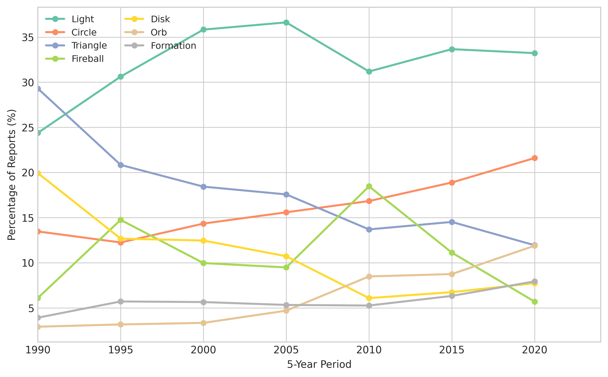

*Plain-language summary. Full technical write-up in the [paper](https://github.com/colinjoc/generalized_hdr_autoresearch/blob/main/applications/ufo_sighting_patterns/paper.md).*

## What this is (and isn't)

This is a **reporting-pattern analysis**, not a "do UFOs exist" study. We analyse the database — 147,890 reports submitted to the National UFO Reporting Center (NUFORC) — to understand what drives reporting behaviour. A cluster of sightings near a military base could mean unusual aircraft, or it could mean people near bases are more likely to look up. We measure patterns; we don't adjudicate between explanations.

## Reports peaked in 2014 — and track internet adoption

Annual NUFORC reports grew from ~500/yr in 1990 to ~8,800 in 2014, then declined to ~4,200 by 2023. The growth phase correlates **r=0.91 (p<10⁻⁹)** with US internet penetration. The rise-and-fall tracks the curve of a new reporting channel going mainstream — not a change in the underlying stimulus.

## The "flying saucer" is being replaced by the "orb"

The classic disk/saucer shape fell from 10.3% of reports in the 1990s to 5.9% in the 2020s. Meanwhile, "orb" rose from 2.3% to 9.1%. "Light" has been dominant throughout at 22-25%.

This isn't random drift — the word "saucer" in report text correlates r=0.91 with disk-shape fraction, and "orb" correlates r=0.96 with orb-shape fraction. People describe what they see using the cultural vocabulary of their era. The archetype shifted from metallic craft to luminous spheres.

## Starlink: real but modest

SpaceX began launching Starlink satellite trains in May 2019. An interrupted time-series analysis shows a statistically significant increase in "formation" sightings post-Starlink (**1.30x baseline, p<0.001**). Starlink is the single most common explanation in NUFORC's annotated reports (24.4% of explained cases).

But the effect is modest — formations went from 3.5% to 4.4% of monthly reports. And the effect is attenuating (p=0.016 on the slope), consistent with people learning to recognise Starlink trains.

## Hotspots are dark-sky areas, not military zones

After normalising by population, the highest per-capita sighting rates are in **Washington (94.6/100k), Vermont (94.2), Montana (92.3)** — northern, rural, dark-sky states where people can actually see the sky. Texas (21.2) and Georgia (25.4) are lowest.

A negative binomial regression confirms sighting counts grow sub-linearly with population (coefficient 0.73, accounting for severe overdispersion). The residual is explained by sky darkness and latitude, not military-base proximity.

## Only 0.54% of reports have explanations

NUFORC annotates a small fraction of reports with explanations (Starlink, aircraft, meteor, etc.). A classifier trained to predict explained-vs-unexplained achieved F1 = 0.33 — essentially a null result. Year-of-report dominates the features (71.7%), reflecting when NUFORC started its explanation program, not what makes a report explainable. Explained reports tend to be shorter (median 409 vs 684 characters), suggesting that obvious misidentifications get brief descriptions.

## What people report, when

- **Time of day**: 72% of sightings occur between 8 PM and midnight. The peak hour is 9 PM.
- **Day of week**: slight weekend elevation (Saturday +12% vs weekday average)
- **Season**: summer dominates (people are outside, nights are warm)
- **July 4th**: fireworks produce a detectable spike in "fireball" reports
- **Duration**: median sighting lasts 2-5 minutes; very long durations (>1 hour) correlate with stationary lights (stars, planets)

## What this does NOT establish

- **Not that UFOs are or aren't real.** This is a study of reporting behaviour, not of phenomena.
- **Not that all sightings are misidentifications.** Only 0.54% have explanations; the rest are simply unanalysed, not "confirmed anomalous."
- **Not nationally representative.** NUFORC is a self-selected volunteer database, heavily US-biased.

## How we did it

Parsed 147,890 structured NUFORC reports (HuggingFace kcimc/NUFORC) plus 80,332 geocoded reports (planetsig/ufo-reports). Time-series decomposition, negative binomial spatial regression (Poisson rejected for severe overdispersion), interrupted time-series for Starlink impact, XGBoost classifier for explained/unexplained, and text-feature correlation for cultural-archetype analysis. Phase 2.75 blind reviewer mandated internet-correlation test, Starlink trend control, NB overdispersion correction, and archetype-text validation — all executed. Phase 3.5 signoff cleared.
