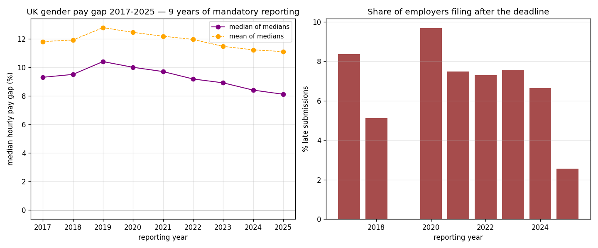

*A plain-language summary. The [full technical paper](https://github.com/colinjoc/generalized_hdr_autoresearch/blob/main/applications/uk_gender_pay_gap/paper.md) has the diagnostics and experiment logs. See [About HDR](/hdr/) for how this work was produced and reviewed.*

**Bottom line.** The UK gender pay gap has narrowed every year since 2021. Inside companies that have reported every year since 2017, the median gap dropped by more than two percentage points and 61 percent of firms narrowed their gap. But once the COVID reporting regime is handled honestly, the underlying trend is 0.15 to 0.20 percentage points per year — implying that reaching full parity under the current regime is a 40 to 55 year project, not the 30-year horizon a back-of-envelope calculation suggests.

## The question

In April 2017 the UK introduced a rule it had never had before: every employer with 250 or more staff must publish six specific numbers every April. The mean and median hourly pay gap between men and women. The mean and median bonus gap. The share of men and women who got a bonus. And the gender composition of each quartile of hourly pay. The theory was that sunlight would do the work — naming the gap publicly, in every firm, every year, would create internal pressure to narrow it.

Nine full reporting cycles have now been filed. Roughly 94,000 employer-year submissions from about 22,500 unique employers are on the public record. The obvious question: has the gap actually moved, and if so, by how much, and in what parts of the economy?

There are two ways the headline gap can fall. A firm can genuinely reform — promote more women into senior roles, recruit differently, restructure pay bands. Or the reporting population can recompose — smaller, less pay-disparate firms enter the disclosure pool as they grow past the 250-employee threshold, dragging the average down without anyone at any single firm having changed anything. A panel this long can distinguish the two.

## What we found

Yes, the gap has moved. More slowly than headline figures suggest, and the truest signal sits inside firms that have reported every year.

- The median gap across all reporting employers fell from 9.30 percent in 2017 to 8.11 percent in 2025 — a narrowing of 1.19 percentage points, with a confidence interval that excludes zero.
- Among more than 5,200 employers that reported under the same name in both 2017 and 2025, the median within-firm reduction was 2.10 percentage points — nearly twice the population-wide figure. 61 percent of these persistent employers narrowed their gap. The chance this is a statistical fluke is vanishingly small.
- Once the unusual COVID filing-waiver regime (2019 to 2021) is properly accounted for, the underlying trend is 0.15 to 0.20 percentage points per year — noticeably slower than the 0.25 per year a naive endpoint calculation gives. At that rate, closing the gap entirely is a 40 to 55 year project.
- The very largest employers (20,000 or more staff) have the smallest gaps, around 5 percent. The "just over the threshold" band (250 to 999 staff), where formal HR infrastructure is often still developing, has the largest, around 9 percent.
- Public Administration, Information and Communication, and Construction narrowed fastest. Education appears to have moved the other way — the population median Education gap nearly tripled, from about 10 to 23 percent. That is not schools getting worse. It is a composition effect: as Multi-Academy Trusts crossed the 250-employee threshold, the number of Education filings nearly tripled, and schools have a strongly female workforce with a male-dominated senior-leader stratum.
- Employers filing late had smaller gaps than on-time filers in every mandatory size band (about a 1.85 percentage point difference after controlling for size and year). The pattern reverses among small firms filing voluntarily. The "late filers are the offenders" intuition is wrong for the mandatory population.
- Compliance has improved. The 2025 reporting year had a 2.5 percent late-filing rate, a record low and a step change from the 7 to 8 percent typical earlier in the decade.

## Why that matters

The most consequential finding is the gap between two plausible-sounding numbers: 0.25 percentage points a year, taken endpoint to endpoint, and 0.15 to 0.20 percentage points a year, once the COVID reporting regime is handled honestly. The first gets you a 30-year horizon to parity. The second gets you 40 to 55 years. Half of any progress claim rests on which of those is quoted.

The Education finding is the other surprise. Read as a headline, "the Education pay gap tripled during mandatory disclosure" sounds like a scandal. The actual story is compositional — the reporting population tripled as academy trusts consolidated past the threshold, and the sector's baseline workforce structure drags the aggregate median upward. The right lesson is not about failing schools. It is about how much apparent sectoral progress is real versus how much is composition churn in the reporting pool.

## What it means in practice

**For workers.** The gap is genuinely moving in the right direction. Progress within established reporting employers averages 0.15 to 0.20 percentage points per year. That is real and sustained. But at this rate, today's entrants will not see the gap close during their careers under the existing regime.

**For policymakers.** Mandatory disclosure has produced real within-firm movement — persistent firms are narrowing at roughly twice the population rate. The wider headline figure is diluted by compositional churn. If the goal is to accelerate progress, the plausible levers are lowering the 250-employee threshold (currently about 60 percent of the UK workforce is in firms below it, and therefore not in the data at all), adding ethnicity and disability reporting, mandating published action plans, or linking compliance to procurement. The pure mandatory-disclosure lever has produced what mandatory-disclosure levers usually produce: gradual convergence, not a step change.

**For analysts and journalists reading disclosure data.** The Education case is a general cautionary tale. When a sector's reporting population triples over the study window, the sector-level median is a composition story before it is a progress story. A within-firm-only sectoral breakdown is the appropriate follow-up.

**For researchers.** The dataset is clean, completely public, and nine years deep. It is one of the best panels available anywhere for studying the slow dynamics of pay disparity under a regulatory treatment. Ireland introduced a near-identical regime in 2023, currently for firms with 150 or more staff and phasing to smaller thresholds; an Ireland-minus-UK difference-in-differences is the natural next paper.

## How we did it

We downloaded the full [UK Gender Pay Gap Service](https://gender-pay-gap.service.gov.uk/) archive — one CSV per reporting year from 2017-18 through 2025-26 — concatenated into a 93,777-row employer-year panel, computed annual medians and means, identified the 5,259-employer within-firm panel that reported in both endpoint years, and cross-tabulated by filing timeliness and employer size. We then ran bootstrap confidence intervals on every headline estimate, a non-parametric significance test on the paired within-firm delta, a size-stratified regression of the late-filer comparison, a three-specification COVID-sensitivity analysis of the trend slope, a robustness test across three different firm identifiers, and a one-digit industry-classification decomposition of sectoral moves.

## Further reading

- [UK Gender Pay Gap Service](https://gender-pay-gap.service.gov.uk/) — the public reporting portal.
- [Equality and Human Rights Commission guidance](https://www.equalityhumanrights.com/en/advice-and-guidance/gender-pay-gap-reporting) — the regime's oversight authority.
- [Full technical paper](https://github.com/colinjoc/generalized_hdr_autoresearch/blob/main/applications/uk_gender_pay_gap/paper.md) — all experiments, the full sector table, and the cross-firm-identifier robustness check.
