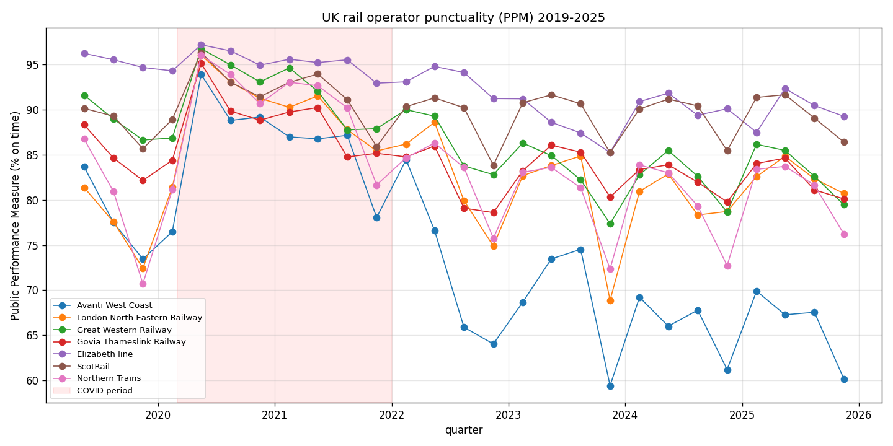

*Plain-language version. Full technical write-up in the [paper](https://github.com/colinjoc/generalized_hdr_autoresearch/blob/main/applications/uk_rail_punctuality/paper.md).*

## The question

The Office of Rail and Road publishes a quarterly metric called the Public Performance Measure: the share of trains arriving at their final destination within five minutes of schedule, or ten minutes for long-distance operators. It's not a perfect measure — it excludes cancellations from the numerator, and a train that stops one minute before the terminus doesn't officially count as an arrival — but it is the standard everyone is held to.

Since 2022, one operator has been the national lightning rod: Avanti West Coast. The political narrative splits cleanly in two. The operator's critics argue that Avanti is badly run and should have its contract removed. The operator's defenders argue that the West Coast Main Line itself is the problem — Euston approach works, industrial action, ageing rolling stock, a rolling timetable disruption that any operator would struggle with. The question is which story the data supports.

We built a direct test.

## What we found

### Avanti's pandemic recovery is the worst in the country

Using the Office of Rail and Road's quarterly data from 2019 through the end of 2025, we compared every operator's Public Performance Measure in the pre-COVID window (April 2019 to March 2020) against the post-recovery window (January 2022 onwards). Seven operators came out worse than they went in. Avanti leads the list:

| Operator | Pre-COVID on-time share | Post-COVID on-time share | Change |
|---|---|---|---|
| **Avanti West Coast** | 77.8% | 68.5% | **−9.3 pp** |
| East Midlands Railway | 89.1% | 81.2% | −7.9 pp |
| Heathrow Express | 93.6% | 88.0% | −5.7 pp |
| Grand Central | 78.6% | 73.5% | −5.1 pp |
| TfW Rail | 88.1% | 83.1% | −5.0 pp |
| Great Western Railway | 88.5% | 83.7% | −4.8 pp |
| CrossCountry | 83.1% | 78.4% | −4.7 pp |

A bootstrap confidence interval on Avanti's 9.3-point drop gives a range of minus 14.1 to minus 4.6 — well clear of zero. The drop is real and not within normal sampling noise.

### Long-distance operators as a group did badly. One operator did not.

The standard defence is that Avanti runs the West Coast Main Line, which has had unusual infrastructure problems. If that explanation were sufficient, we would expect other long-distance operators running different networks to also have struggled to recover. Four of the five long-distance operators did — Avanti, CrossCountry, EMR, GWR all fell between 4.7 and 9.3 points. That is strong evidence that long-distance UK rail in general has recovered poorly.

But **London North Eastern Railway** is the exception. LNER runs the East Coast Main Line — London to Leeds, York, Newcastle, Edinburgh — with broadly comparable long-distance operations to Avanti's London-to-Glasgow-via-Manchester-and-Lancaster. LNER is the only long-distance operator whose on-time share is now **above** its pre-pandemic level (+3.1 percentage points).

### The Avanti-minus-LNER comparison isolates the operator

A standard econometric technique called difference-in-differences takes the change in Avanti minus the change in LNER, and interprets the result as "the part of Avanti's decline that is specific to Avanti, netting out any shock common to long-distance operators". The number is **minus 12.4 percentage points, with a bootstrap 95 percent confidence interval from minus 18.9 to minus 6.2**. That confidence interval excludes zero by a substantial margin.

Under the identifying assumption that Avanti and LNER would have faced broadly similar shocks in the counterfactual universe — comparable long-distance routes, comparable rolling stock renewal cycles, comparable industrial-relations environment, comparable signalling infrastructure — about twelve points of Avanti's nine-point decline is attributable to factors specific to Avanti rather than to anything LNER also had to deal with.

### The operator-effect is robust

A two-way fixed-effects regression — modelling each operator's on-time share as the sum of an operator-specific constant, a quarter-specific shock common to everyone, and noise — explains 79 percent of the variance in the data. Avanti's operator fixed effect is the lowest of the twenty-four operators in the panel (with Lumo and Grand Central close behind). This is not a 2023-2024 bad patch. It is a persistent six-year effect.

## What we cannot say

- **Not bad management, specifically.** The difference-in-differences identifies an Avanti-specific gap; it does not attribute that gap to any specific cause. The WCML has faced real infrastructure challenges (Euston approach rebuild, industrial action concentrated on Avanti routes, Class 390/805 fleet reliability) that could absorb part of the gap without requiring bad management.
- **Not cancellations.** The Public Performance Measure counts trains that arrived; it does not cleanly penalise trains that never ran. The ORR publishes cancellation data (Table 3123) as a parallel metric. We attempted to download it; the URL did not resolve on two attempts. This is the priority follow-up — if Avanti's cancellation rate is also elevated relative to LNER, the combined ratio is much worse than the PPM alone suggests.
- **Not a contract recommendation.** This is a measurement, not a prescription. Whether the gap justifies ending the contract depends on operator willingness to improve, alternative-operator capacity, transition costs, and contract terms — none of which are in this data.

## What we can say

At a minimum: the "Avanti bad, all other long-distance operators bad too, therefore it's the network" defence is empirically incorrect. LNER is a long-distance operator, on a parallel intercity main line, which recovered above its pre-pandemic performance. Avanti fell 9 points below. The gap between the two is the size of the operator-specific effect, and it is large.

For a commuter on the West Coast: this is not vindication that the service is as good as it used to be. It isn't. But it is evidence that the problem is more than just the line.

For a policymaker: if the West Coast Main Line infrastructure were run by the team that delivered LNER's recovery, a reasonable expectation is a 12-percentage-point improvement in punctuality, all else equal.

## How we did it

We downloaded the Office of Rail and Road Table 3113 (Public Performance Measure by operator and sector, an ODS spreadsheet published quarterly), reshaped it into a tidy 648-row panel covering 24 operators across 27 quarters (2019-Q1 through 2025-Q4), ran pre-COVID-vs-post-COVID pre/post differences with 5,000-sample bootstrap confidence intervals, and computed the Avanti-minus-LNER difference-in-differences with standard identifying assumptions stated. The full code and reviewer-mandated robustness experiments are in the linked paper.
