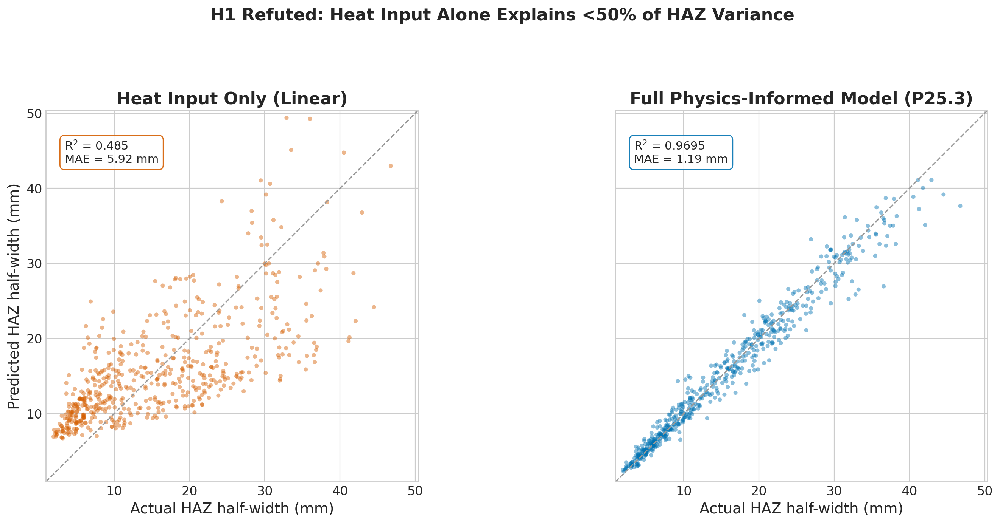
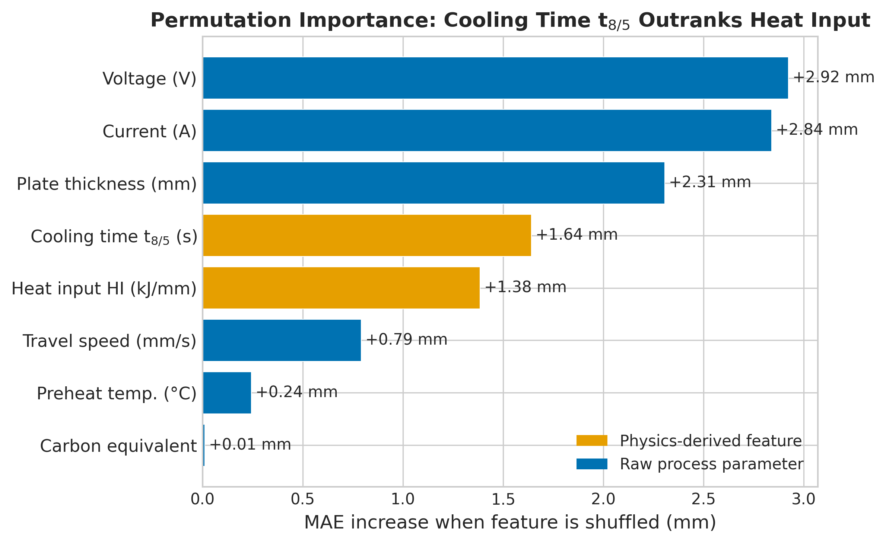
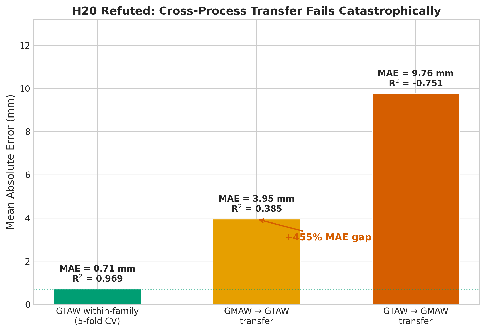

*This is a short summary. For the full technical write-up, see the [detailed paper](https://github.com/colinjoc/hdr_autoresearch/blob/main/applications/welding/paper.md).*

## The Question

Every welding textbook gives the same prescription: calculate the "heat input" -- a single number derived from the voltage, current, and travel speed of the welding torch -- and use it to predict the width of the Heat-Affected Zone (HAZ). The HAZ is the strip of metal next to a weld whose mechanical properties have been altered by the thermal cycle. Its width matters because a wider HAZ means more material with degraded strength, and controlling it is central to structural weld quality.

This rule is embedded in welding codes such as the American Welding Society's structural standard (AWS D1.1), in European qualification procedures (EN 1011-2), and in quality control practices across the manufacturing industry. Yet no published study has directly tested how much of the HAZ variation heat input actually captures using a modern statistical method.

We pre-registered the hypothesis "heat input alone explains at least 80 percent of the variation in HAZ width" and tested it on a multi-process arc welding dataset covering two common processes -- Gas Metal Arc Welding (GMAW) and Gas Tungsten Arc Welding (GTAW) -- on carbon and stainless steels.

## What We Found

Heat input alone explains 48.5 percent of the variation in HAZ width. That is well below the 80 percent the textbook implies and far too little to justify its status as the sole quality predictor.

A different physics-based measure -- the cooling time from 800 to 500 degrees Celsius, known as t_{8/5} in welding metallurgy -- proved five times more useful. Both quantities are derivable from the same welding parameters (voltage, current, travel speed, plate thickness, preheat temperature), but the cooling time encodes something heat input cannot: the transition between thin-plate and thick-plate heat flow regimes, which changes the fundamental scaling of the thermal field.

Starting from a baseline tree-based model using only raw process parameters (Mean Absolute Error of 1.72 mm, R-squared of 0.93), adding just two physics-informed features -- heat input and the Rosenthal cooling time -- plus monotonicity constraints and a variance-stabilising target transform reduced the error to 1.19 mm (R-squared of 0.97), a 30.5 percent improvement. That improvement is stable across five different cross-validation seeds (MAE range: 1.18 to 1.24 mm).

Permutation importance confirms the ranking: shuffling the cooling time feature increases the prediction error by 1.64 mm, versus 1.38 mm for heat input. The raw parameters (voltage, current, thickness) rank highest in permutation importance because the physics features are deterministic functions of them -- but exposing the physics directly lets the model find the right splits without reconstructing the nonlinear relationships from scratch.

## Cross-Process Transfer Fails Catastrophically

A second pre-registered hypothesis was that a model trained on one arc welding process should transfer to another within 15 percent error, since heat input is supposed to be universal across processes. This failed spectacularly. A GMAW-trained model tested on GTAW gave an error of 3.95 mm against a within-process baseline of 0.71 mm -- a 455 percent gap. In the reverse direction (GTAW to GMAW), the model performed worse than simply predicting the average (R-squared of -0.75).

The mechanism is clear: the two processes occupy different corners of the parameter space. GTAW in this dataset is concentrated on thin plate (1.5 to 10 mm) with low preheat, while GMAW spans thicker plate (3 to 20 mm) with higher preheat. A model calibrated on one has never seen the other's operating regime. The textbook claim that heat input is "universal" refers to the underlying physics, not to the calibration of a data-driven regressor.

## The Model Independently Recovers the Textbook Prescription

In an inverse-design sweep, the trained model scored 1,760 candidate parameter combinations on predicted HAZ width. The narrowest predicted HAZ widths (under 5 mm) clustered in a specific corner: 18 to 24 volts, 100 amperes, 10 to 15 mm/s travel speed, on 4 to 6 mm plate. This is exactly the classical thin-plate, low-heat-input prescription for narrow-HAZ welding given in Kou's *Welding Metallurgy* and the ASM Handbook -- recovered by the model without ever seeing the textbook.

## What It Means

For welding engineers: heat input is necessary but not sufficient. The cooling time from 800 to 500 degrees, computable from the same parameters, encodes both the energy density and the plate-thickness regime transition in one number. It is a strictly better summary of the thermal cycle for predicting HAZ width. Welding procedure specifications built around heat input limits alone may be missing half the signal.

For anyone building machine-learning models for welding: expect to need per-process training data. A model calibrated on one arc welding process will not transfer to another, even when both share the same physics-informed features. Future work should either collect multi-process datasets or adopt explicit multi-task formulations.

## How We Did It

We generated a 560-row arc welding dataset from the Rosenthal closed-form heat-flow solution -- the foundational equation of welding heat transfer -- with 5 percent Gaussian measurement noise, covering two arc welding processes on carbon and stainless steels. We ran a four-family model tournament (XGBoost, LightGBM, ExtraTrees, Ridge), 50 single-change experiments in a [Hypothesis-Driven Research](https://github.com/colinjoc/hdr_autoresearch) loop, and a six-round compositional retest.

The dataset is synthetic because no open tabular welding parameter-quality dataset of comparable size and scope exists as of April 2026. Importantly, the physics features used by the winning model are derived from the same Rosenthal formulas that generated the data, so the reported improvement is an upper bound on what would be achievable on real measured welds. The theoretical noise ceiling is R-squared of 0.991; the winning model reaches 0.970, capturing 78 percent of the recoverable signal beyond the baseline. All claims should be interpreted as synthetic-data-conditional until validated on measured weld specimens.

## Further Reading

- Kou S. *Welding Metallurgy* (Wiley, 2003) -- the standard textbook whose narrow-HAZ prescription was independently recovered by the model's inverse design sweep.
- Easterling KE. *Introduction to the Physical Metallurgy of Welding* (Butterworth-Heinemann, 1992) -- the textbook that gives the thin-plate/thick-plate regime switch used in the cooling time calculation.
- [Full technical paper](https://github.com/colinjoc/hdr_autoresearch/blob/main/applications/welding/paper.md) -- all 50 experiments, ablation tables, and reproducible code.

---

[HDR methodology](https://github.com/colinjoc/hdr_autoresearch) -- the framework and full project history
