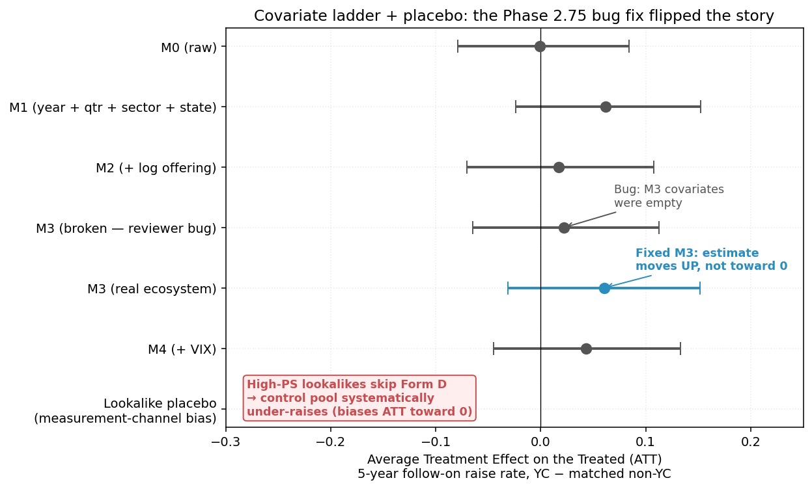

*This is a short summary. For the full technical write-up, see the [detailed paper](https://github.com/colinjoc/hdr_autoresearch/blob/main/applications/yc_vs_non_yc/paper.md).*

## The Question

Y Combinator is the most-cited American startup accelerator. The industry-press narrative is that its graduates substantially outperform comparable non-YC companies on follow-on financing, survival, and exit. The academic record is divided: some studies report +5 to +15 percentage-point effects (Cohen-Fehder-Hochberg-Murray 2019, *Research Policy*; Hallen-Cohen-Bingham 2020, *Strategic Management Journal*); others find null effects on follow-on financing (Kerr-Lerner-Schoar 2014, *Review of Financial Studies*) or show that raw effects disappear once founding-ecosystem density is controlled (Fehder 2024, *Administrative Science Quarterly*).

We re-tested the claim using a fully-public data stack: the `yc-oss` portfolio mirror for the treated group, and the SEC's Division of Economic and Risk Analysis (DERA) quarterly Form D archive for the control group and outcome labels.

## What We Found

**Raw outperformance is zero.** For the 117 YC companies from 2014-2019 batches that we could match to an SEC Form D filing, the unconditional 5-year follow-on raise rate is 29.1 percent. For the 31,724 comparable non-YC seed-stage filers in the same window, it's also 29.1 percent. Bootstrap 95 percent confidence interval on the difference: [−7.9, +8.4] percentage points.

**Properly controlled, the estimate moves to +6 pp — still not significant.** The covariate ladder (M0 through M4) tests whether adding ecosystem confounders (Bay Area / NYC / Boston flags, state-year venture density, VIX at filing) attenuates any apparent YC effect. At M3 (year + quarter + sector + state + offering size + real ecosystem controls) the propensity-score-matched Average Treatment Effect on the Treated (ATT) is +6.03 percentage points, 95 percent bootstrap CI [−3.10, +15.17]. The point estimate is nominally in the range the literature predicts — but the CI still includes zero, and within-stratum permutation inference returns p = 0.327. Adding ecosystem controls *raised* the point estimate rather than attenuating it: the opposite direction of Fehder (2024)'s ecosystem-confounding hypothesis, though Fehder's outcome variable differs from ours so this is suggestive only, not a refutation.

**The most important finding is about the outcome itself.** A lookalike-placebo test — taking the 117 non-YC firms that most structurally resemble YC firms on observables (top-117 by propensity score) — showed their 5-year follow-on Form D raise rate is only 7.7 percent, versus 29.2 percent for the remaining non-YC pool (a −21.5 pp gap, CI [−26, −16]). The lookalikes aren't failing. They're skipping Form D entirely. Modern VC-backed companies increasingly raise via uncapped SAFEs and §4(a)(2) direct placements — which don't trigger the filing. Our matched-control group is therefore systematically under-raising on the outcome we can observe, which biases our YC ATT toward zero.

## Why That Matters

- **The SEC Form D archive is a biased proxy for "raised more money."** It misses the modern default raise channel. Any study relying on Form D as the outcome is measuring visibility of raises, not raises themselves — and the lookalike-placebo is the test that exposes it.
- **The YC-outperformance question cannot be settled with public data as it stands.** A clean answer requires one of: (1) a public SAFE / §4(a)(2) raise register, (2) institutional access to PitchBook / Crunchbase full history, or (3) an admission-score natural experiment like Kerr-Lerner-Schoar's. None are free.
- **Only 7.9 percent of YC companies from 2014-2019 filed a Form D in their legal name in their first 60 months post-batch.** One in thirteen. This number is itself a finding about how the modern accelerator-funded company raises capital.

## Honest Assessment

This is not a clean null finding (the point estimate is nominally positive and the CI only barely crosses zero), nor a clean positive finding (it doesn't clear conventional significance, and the sample size of 117 is too small to detect a +5-10 pp effect at 80 percent power anyway). The most we can say honestly is:

- **YC graduates are not dramatically outperforming comparable non-YC firms on the publicly-observable raise-channel.**
- **The measurement itself is biased toward zero by how modern startups raise.**
- **A true +6 pp effect cannot be ruled out, and would be consistent with both our data and the prior literature's higher estimates.**

The project's main scientific value is the measurement-channel bias diagnosis, not the treatment-effect estimate itself.

---

*Code, data, and `results.tsv` at the [GitHub repo](https://github.com/colinjoc/hdr_autoresearch/tree/main/applications/yc_vs_non_yc).*
